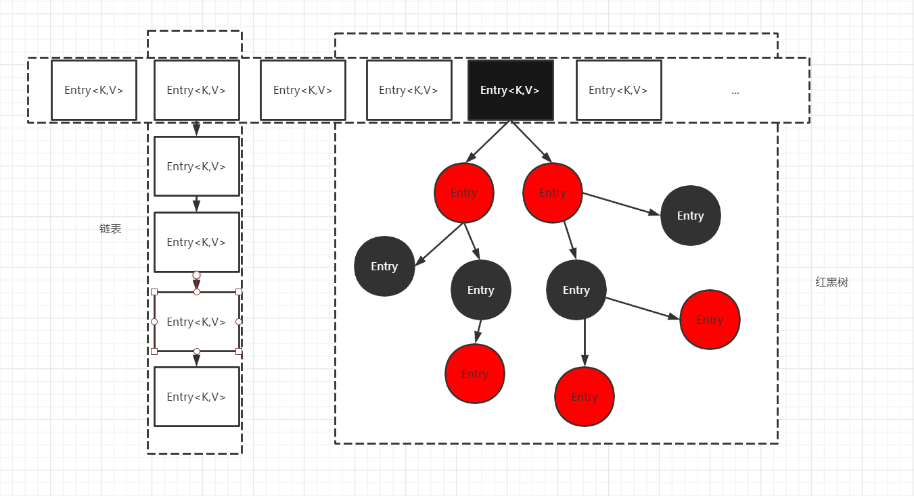
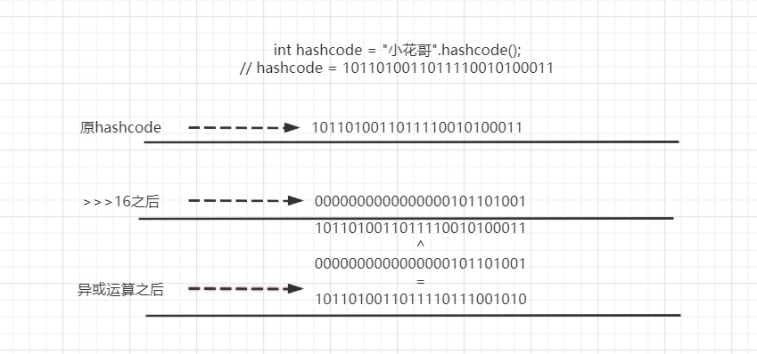
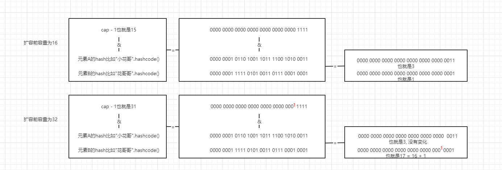
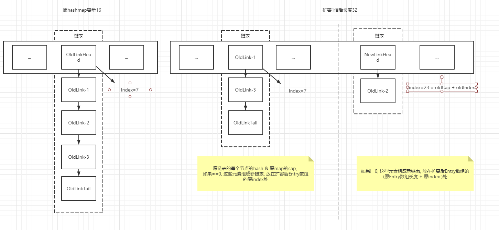
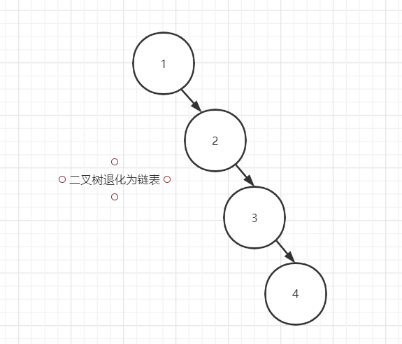
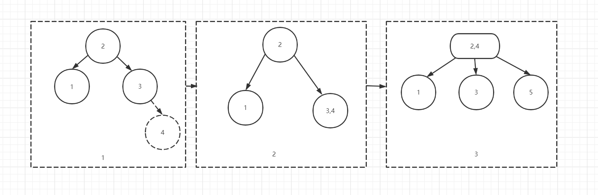

# HashMap



HashMap底层基于数组和链表(单向)实现, 当链表中元素达到8个之后会转化为红黑树. 

## hashcode与31

我们都知道HashMap在put一个键值对, 会先计算的Key的hashcode来得到键值对应存放在数组中的位置. 当下次get时, 重新计算hashcode就可以得出key在数组中的index. 

```java 
    // String的hashcode
    public int hashCode() {
        int h = hash;
        if (h == 0 && value.length > 0) {
            char val[] = value;

            for (int i = 0; i < value.length; i++) {
                // 使用了一个魔术值31
                h = 31 * h + val[i];
            }
            hash = h;
        }
        return h;
    }
```
`Effective Java`中的答案是31是一个奇质数, 如果乘数是偶数,有可能会导致乘积运算时溢出. 
由于在乘积运算时, 使用位移可以提高性能. 所以其实使用偶数的运算效果更好一些. 但是又不能使用偶数. 同时计算出的结果要足够大且不能溢出, 所以经过多次实验, 31出现了.

`31 * i == (i << 5) - i` , 31是质数的同时, 占用空间小, 还可以直接用位移运算和减法来提高效率.

::: tip <span id='31'>奇数也会溢出</span>
其实不论奇数偶数, 都有溢出的可能, 只不过在位移运算时, 偶数的最低位只有可能是0, 而奇数的最低位有可能是1也有可能是0. 而再散列表中, 自然是越分散越好. 所以奇数优于偶数. 

至于怎么找到31, 那就要问hashcode方法的创造者了, 我们只是用了冰箱, 然后拆开冰箱查看怎么设计而已. 
:::

## 扰动函数

由于使用数组存放键值对, 当hash计算出现碰撞次数过多时, 就会导致频繁的链表与树的遍历操作. 这时就失去了散列的意义. 所以HashMap在存放元素是使用了一个方法`hash`来处理key的hashcode, 用于优化散列效果.

```java 
    static final int hash(Object key) {
        int h;
        return (key == null) ? 0 : (h = key.hashCode()) ^ (h >>> 16);
    }
```

在hash方法中, HashMap先将key的hashCode向右位移了16位, 也就是也就是hashcode长度的一半(hashcode是int类型,32位), 然后再与原来的hashcode做亦或运算, 混合hashcode的高16位与低16位. 
## 初始化容量

```java
    
    // 延迟初始化, 在没有使用之前table的容量一直都是0
    public HashMap() {
        this.loadFactor = DEFAULT_LOAD_FACTOR; // all other fields defaulted
    }

    // 立刻初始化容量
    public HashMap(int initialCapacity) {
        this(initialCapacity, DEFAULT_LOAD_FACTOR);
    }  
    
    public HashMap(int initialCapacity, float loadFactor) {
        
        // 各种校验
        if (initialCapacity < 0)
            throw new IllegalArgumentException("Illegal initial capacity: " +
                                               initialCapacity);
        if (initialCapacity > MAXIMUM_CAPACITY)
            initialCapacity = MAXIMUM_CAPACITY;
        if (loadFactor <= 0 || Float.isNaN(loadFactor))
            throw new IllegalArgumentException("Illegal load factor: " +
                                               loadFactor);
        this.loadFactor = loadFactor;
        // 调整初始容量
        this.threshold = tableSizeFor(initialCapacity);
    } 
    
    // 确保容量为2的整数倍
    static final int tableSizeFor(int cap) {
        // 如果传递参数cap是17
        int n = cap - 1;  // n =  10000
        n |= n >>> 1;     // n =  11000
        n |= n >>> 2;     // n =  11110
        n |= n >>> 4;     // n =  11111
        n |= n >>> 8;     // n =  11111
        n |= n >>> 16;    // n =  11111
        // 此时n 也就是hashmap的容量调整为了32
        // 一直做位移运算的原因是把cap的各个位置都填上1,            这样当n + 1是自然就得到一个2的整数倍了              
        return (n < 0) ? 1 : (n >= MAXIMUM_CAPACITY) ? MAXIMUM_CAPACITY : n + 1;  
    }
    
    final V putVal(int hash, K key, V value, boolean onlyIfAbsent,
                   boolean evict) {
        Node<K,V>[] tab; Node<K,V> p; int n, i;
        if ((tab = table) == null || (n = tab.length) == 0)
            n = (tab = resize()).length;
        //  定位元素位置的方式是 (table.length - 1) & hash    这个hash是经过扰动函数hash()计算得出的           
        if ((p = tab[i = (n - 1) & hash]) == null)
            tab[i] = newNode(hash, key, value, null);
        else {
            ...
        }
    }         

```

我们都知道在使用HashMap在没有hash碰撞时, 他的时间复杂度为O(1), 而如果出现hash碰撞, 也就是出现链表与树时, 那么在索引一个元素时, 就要再O(1)的复杂度上再多一步遍历hash碰撞元素的次数. 
所以我们要尽量避免出现hash碰撞的问题保证HashMap存取数据的效率, 要让元素在table中尽量的分散. 

在[hashcode与31](#31)中我们已经知道了奇数比偶数在hash计算中出现hash碰撞的可能性更小. 而HashMap的设计者规定了HashMap的容量必须为2的整数倍, 那么在使用的(table.length - 1) & hash得出的
元素所在table的index的碰撞的概率也就大大减少了. 

## 负载因子

负载因子决定了HashMap中存放的元素数量达到多少以后进行扩容操作. HashMap的默认负载因子为0.75. 也就是当元素的数量达到了 容量上限 * 0.75时, 会将table扩容一次. 
为什么使用0.75作为负载因子, 如果使用大于0.75的数, 比如1, 那么当table被放慢时才会扩容, 这会出现大量的冲突, 如果使用小于0.75的数, 虽然减少了碰撞的概率, 但table会扩容的非常频繁, 同时造大量的内存浪费.
所以使用0.75折中, 在时间与空间之间找到一个平衡点 

## 扩容

直接看源码
```java 
    final Node<K,V>[] resize() {
    
    // 计算新Entry长度与新的threshold
        Node<K,V>[] oldTab = table;
        int oldCap = (oldTab == null) ? 0 : oldTab.length;
        // threshold变量 容量与负载因子的乘积
        int oldThr = threshold;
        int newCap, newThr = 0;
        // 判断是否已经初始化过
        if (oldCap > 0) {
            if (oldCap >= MAXIMUM_CAPACITY) {
                // 如果当前的阈值已经打到了上限则不再扩容
                threshold = Integer.MAX_VALUE;
                return oldTab;
            }
            // 扩容一倍
            else if ((newCap = oldCap << 1) < MAXIMUM_CAPACITY &&
                     oldCap >= DEFAULT_INITIAL_CAPACITY)
                // 如果扩容计算没有问题, 将阈值也 * 2 
                newThr = oldThr << 1; // double threshold
        }else if (oldThr > 0){ 
            // 没有初始化过, 则初始化一下, 容量 = 阈值
            newCap = oldThr;
        }else {               // zero initial threshold signifies using defaults
           // 初始化一下 cap = 16; thr = 16*0.75
            newCap = DEFAULT_INITIAL_CAPACITY;
            newThr = (int)(DEFAULT_LOAD_FACTOR * DEFAULT_INITIAL_CAPACITY);
        }
        
        if (newThr == 0) {
            float ft = (float)newCap * loadFactor;
            // 确保阈值被初始化
            newThr = (newCap < MAXIMUM_CAPACITY && ft < (float)MAXIMUM_CAPACITY ?
                      (int)ft : Integer.MAX_VALUE);
        }
        threshold = newThr;
        
   // ---------------------  开始扩容
        
        // 初始化一个新的数组 
        Node<K,V>[] newTab = (Node<K,V>[])new Node[newCap];
        table = newTab;
        
        // 开始迁移元素
        if (oldTab != null) {
            // 若原数组有数据, 重新映射到新数组
            for (int j = 0; j < oldCap; ++j) {
                Node<K,V> e;
                if ((e = oldTab[j]) != null) {
                    // 先将原数组中的元素暂存, 再抹掉原数组的引用
                    oldTab[j] = null;
                    if (e.next == null) {
                        // 普通节点重新计算一下这个元素再新数组中的位置即可
                        newTab[e.hash & (newCap - 1)] = e;
                    } else if (e instanceof TreeNode){ 
                         // 处理是红黑树节点的情况, 下面有单独详解
                        ((TreeNode<K,V>)e).split(this, newTab, j, oldCap);
                    }else {// 链表
                        
                        
                        
    //------------------------------  迁移链表结构
    
    
                            
                        // 这个链表用来保存原table中的头尾  叫她链表一
                        Node<K,V> loHead = null, loTail = null;
                        // 这个链表用来保存需要分配的元素  叫她链表二
                        Node<K,V> hiHead = null, hiTail = null;
                        Node<K,V> next;
                        do {
                            next = e.next;
                            // 将这个节点的hash & 原table的长度
                            // 如果结果为0 , 位置不变
                            if ((e.hash & oldCap) == 0) {
                            
                                // 先看看链表一是不是空的
                                if (loTail == null)
                                   // 如果是空的那就把链表一头设置上
                                    loHead = e;
                                else
                                   // 如果不为空, 那就把这个元素链到链表一的尾端
                                    loTail.next = e;
                                // 更新一下链表一尾    
                                loTail = e;
                            }else {// 如果不为0 
                                
                                // 先看看链表二是不是空的
                                if (hiTail == null)
                                   // 如果是空的  那就把链表二头设置上
                                    hiHead = e;  
                                else
                                    // 如果不为空, 那就把这个元素链到链表二的尾端
                                    hiTail.next = e;
                                // 更新一下链表二尾    
                                hiTail = e;
                            }
                        } while ((e = next) != null);
                        
                        // 看看链表一是不是不为空呀, 如果不为空, 那就把这个元素放到新表中相同的位置
                        if (loTail != null) {
                            loTail.next = null; 
                            newTab[j] = loHead;
                        }
                        // 如果链表二不为空, 那就放在新数组的 原数组长度 + 原数组的index上
                        if (hiTail != null) {
                            hiTail.next = null; 
                            newTab[j + oldCap] = hiHead;
                        }
                    }
                }
            }
        }
        return newTab;
    }

```

以上代码总共完成了两件事情, 计算新的HashMap的容量然后将原Entry[]中元素迁移到新的Entry[]中. 代码迁移部分红黑树节点元素的迁移代码在TreeNode中. 稍后分析.
  
--- 
首先我们已知的两点: **hashmap的扩容是2倍扩展; 元素在Node[]中的索引计算是(cap -1) & hash. 所以元素扩容后要么位置不变, 要么新位置应该是old + oldIndex**.

可以看出, 扩容后的index计算, 关键点在于`((cap << 1) - 1) & hash`后重新得到的index新增的一个bit是1还是0, 如果是0 , 那么扩容后位置不变, 如果是1 ,那么位置应该变更为 oldCap +  oldIndex
 
 
在jdk1.8的优化之后HashMap的元素迁移不再需要重新计算hash. 它只是重新 & 一下 oldCap, 然后与0 比较, 实际效果与jdk1.8之前的重新计算一致, 同时还提高了效率. 
链表迁移的整体流程如下: 


1. 新创建两个链表. link_1, link_2.
> link_1中存放的是hash&oldCap == 0的元素, link_2中存放的是hash&oldCap != 0的元素. 

2. 循环链表中的每个元素做hash&oldCap操作, 同时存放到对应的link中.
> 循环过后, 元素在原链表中的相对位置与再新链表中的相对位置是不变的.

3. 将link_1的head元素放到新Node[]中, 索引为原索引.
4. 将link_2的head元素放到新Node[]中, 索引为oldCap +  oldIndex
 

## 树

在分析hashMap的TreeNode的迁移之前, 需要先了解一下树这种数据结构. 

### 二三树

当二叉树的插入数据时, 他会将要插入的节点与当前的树节点作比较, 如果小在左侧, 如果大在右侧, 如果插入的数据大小一直是递增的情况, 那么会出现二叉树退化为链表的情况.



二三树可以解决二叉查找树数的平衡问题. 它在添加一个节点时, 会先尝试将这个要添加的节点数据暂存在离他最近的一个节点中, 也就是二三树的一个节点中可以存在两个数据, 只有当一个节点出现第三个数据时, 才会调整树的结构



可以看到二三树的叶子节点都在同一层. 如果一个节点有一个数据, 那么它有两个节点, 如果有两个数据, 那么它有三个节点

在二三树之外, 还有二三四树, 它与二三树类似. 这两种模型的代码实现比较烦琐, 且效率不高. 首先节点需要多次比较, 不像二叉树非左即右, 其次结构调整也有一定复杂度.

## 红黑树

红黑树是二三树和二三四数的另外一种表现形式, 它更利于编码实现, 

红黑树的特点:

- 红黑树的根节点是黑色.
- 每个红色节点的两个子节点一定是黑色的. 同一条链路上不能有链路的红色节点
- 任一结点到每个叶子节点的路径都包含数量相同的黑色节点.

### 红黑树的转换规则


参加工作以来经历了三家公司, 每一家公司都给我带来了很大的成长. 

前前后后参与完成上线了8个项目, 从一开始的CRUD, 然后做一些简单的数据库表设计, 单个功能的设计, 到主导整个软甲架构的设计
我都从中学习和实践了到了很多知识.  

这期间自己的知识面, 技术栈也慢慢充实起来, 除了后台的java之外, 也写一些前端的东西, 比如说vue, 还封装过一些组件, 
代码也写的越来越干净整洁, 也学习了一些新的概念. 比如说领域驱动设计,测试驱动开发. 而且也都在项目中实践使用了. 

最重要的对自己的学习方向, 职业规划也有了比较清晰的认知. 也越来越尊重自己的程序员的职业. 

然后平时喜欢看一些技术类的书籍, 做做笔记, 写写博客.


