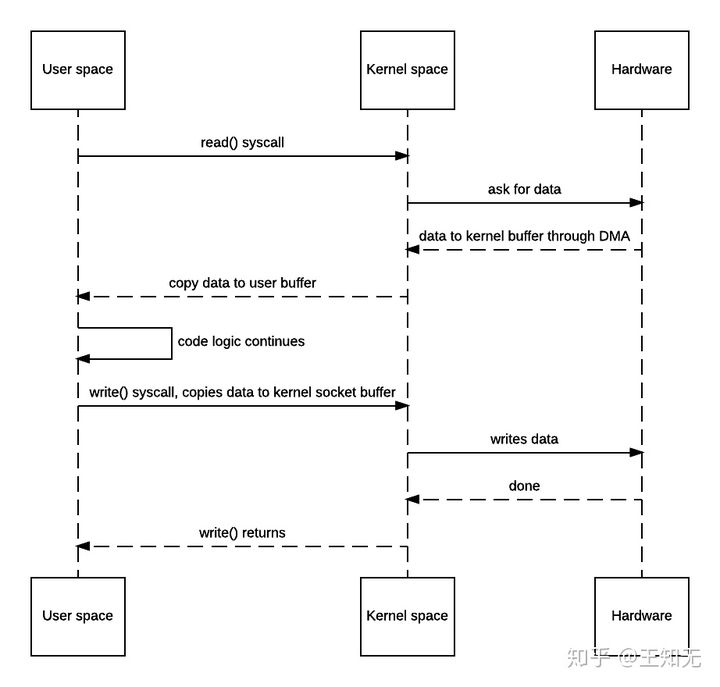
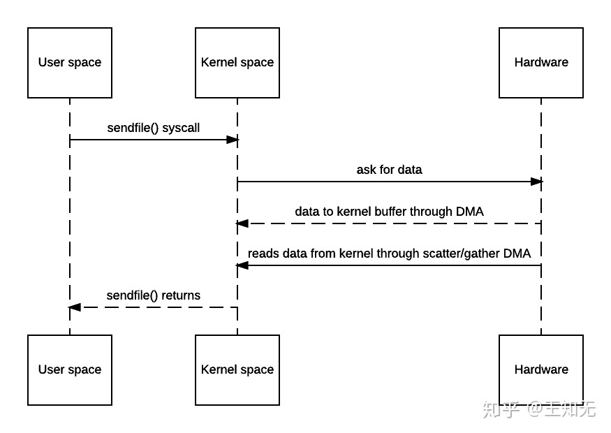

# IO 

java中提供了三种IO, 分别为BIO, NIO, AIO

## BIO

## NIO

同步非阻塞IO
```java 

    private static void test1() throws IOException {

        int[] prots = {5000,5001,5002,5003,5004};
        Selector selector = Selector.open();

        for (int i = 0; i < prots.length; i++) {

            ServerSocketChannel ssc = ServerSocketChannel.open();
            // 配置ssc为非阻塞
            ssc.configureBlocking(false);
            ssc.bind(new InetSocketAddress(prots[i]));

            // 将channel注册到selector上  对socket注册事件感兴趣
            ssc.register(selector, SelectionKey.OP_ACCEPT);
        }

        while (true){
            
            // 这个方法会一直阻塞直到有一个channel在感兴趣的事件上就绪
            int keyNumber = selector.select();

            // 返回已经就绪的channel对应的SelectionKey集合
            Set<SelectionKey> selectionKeys = selector.selectedKeys();
            Iterator<SelectionKey> iterator = selectionKeys.iterator();
            while (iterator.hasNext()){
                SelectionKey next = iterator.next();
                // 检查SelectionKey的事件就绪状态
                if (next.isAcceptable()){
                    // 获取这个SelectionKey对应的channel
                    ServerSocketChannel channel = (ServerSocketChannel) next.channel();
                    SocketChannel accept = channel.accept();
                    accept.configureBlocking(false);
                    // 将新的channel也注册到selector上
                    accept.register(selector,SelectionKey.OP_READ);
                    iterator.remove();
                // 检查channel是否可读    
                } else if (next.isReadable()){

                    SocketChannel channel = (SocketChannel) next.channel();
                    // 分配一个ByteBuffer, 默认返回HeapByteBuffer
                    ByteBuffer buffer = ByteBuffer.allocate(4);
                    int readBytes = 0;
                    while (true){
                        // 读之前先清空buffer
                        buffer.clear();
                        // 将channel中数据读取到buffer
                        int read = channel.read(buffer);
                        readBytes += read;
                        if (read <= 0){
                            break;
                        }
                        // 写前flip
                        buffer.flip();
                        // 原样写回数据
                        channel.write(buffer);
                    }

                    iterator.remove();
                }
            }
        }
    }

```

Selector是一个Reactor对象, SocketChannel可以注册到其上, 并选择感兴趣的事件, 如连接就绪, 连接断开, 可读, 可写等. 

SelectionKey是某种感兴趣的事件的集合, 如可读的key, key可以获取到对应的channel. 

### ByteBuffer

```java 

public abstract class Buffer {
    ...
    // 标记上一次mark的位置, 调用reset()可以将position置为mark的值
    private int mark = -1;
    // 每次读写一个元素之后, position都要 + 1, position是将要去读或写的元素的位置
    private int position = 0;
    // 数据的最大有效位置
    private int limit;
    // buffer最大容量
    private int capacity;
    
    /**
     * 把limit设为当前position位置, 再把position设为0
     * 一般在从Buffer读出数据前调用
     */
    public final Buffer flip() {...}
    
     /**
      * 标记Buffer的一个特定position, 之后可以通过调用Buffer.reset()恢复到这个position
      */
    public final Buffer mark() {...}
    
    /**
     * 恢复标记的position
     */
    public final Buffer reset() {...}
    /**
     * 把position设为0, limit不变.
     * 一般在把数据重写入Buffer前调用
     */
    public final Buffer rewind() {...}
    
    /**
      * 重置buffer, position置为0, limit置为capaticy
      * 一般是写前调用
      */
    public final Buffer clear() {...}
}    

public abstract class ByteBuffer extends Buffer implements Comparable<ByteBuffer>{

    /**
     * 将所有的未读数据复制到Buffer起始位置, 将position设为最后一个未读元素的后边, 将limit设为capacity
     */
    public abstract ByteBuffer compact() {...}    
    
    /**
     * 返回一个buffer的position与limit之间的快照, 底层数组是共享的
     */
    public abstract ByteBuffer slice() {...}     
}

```    

0 <= mark <= position <= limit <= capacity

#### HeapByteBuffer

HeapByteBuffer分配在堆中. 

IO的过程实际是先从直接内存copy到堆中在进行IO操作, 这个copy的动作中不会发生gc, 因为io操作都是操作的操作系统的外设, 如磁盘. 会使用JNI操作, 如果在操作中发生GC, 在GC的标记压缩内存过程中, 
正在使用的内存区域会移动, 影响JNI, 产生OOM等异常.

#### DirectByteBuffer
DirectByteBuffer继承了MappedByteBuffer, 它持有直接内存的地址引用, 直接操作堆外内存. GC通过JNI回收堆外内存

::: tip MappedByteBuffer
文件的内存映射区域.

文件会映射到堆外内存, java程序直接从内存中操作修改
:::
### 零拷贝


传统拷贝的读写会有四次上下文切换以及两次数据拷贝. 
- **读. 一次拷贝**
> 1. 用户态切换到内核态
> 2. 内核态切换回用户态
- **写, 一次拷贝**
> 1. 用户态切换到内核态
> 2. 内核态切换回用户态



用户态发出sendfile指令给内核态 -> 内核态完成数据处理 -> sendfile返回 

零拷贝中用户态通过内存文件映射操作内存
## AIO


