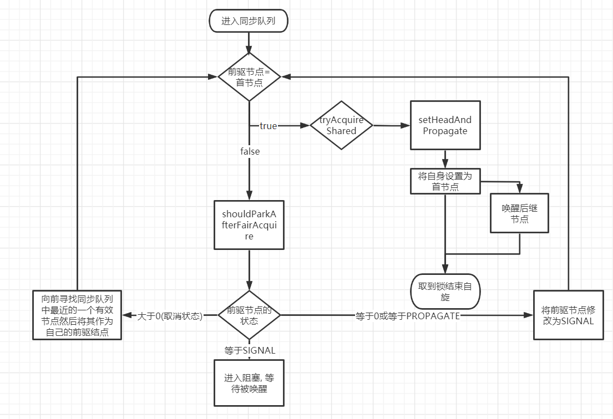

# AQS队列同步器

队列同步器类: AbstractQueuedSynchronizer.

AQS通过内置的FIFO队列完成资源获取线程的排队工作.

AQS自身没有实现任何同步接口, 仅仅是定义了若干同步状态获取和释放的方法供自定义组件使用, 同步器既可以支持独占式的获取同步状态, 也可以支持共享式的获取同步状态. 

AQS面向锁, 锁面向使用者.


## AQS的内置方法

AQS是基于模板方法模式设计的. 其中可重写方法包括:

```java
    /**
     * 独占式获取同步状态, 实现该方法需要查询当前状态并判断
     * 同步状态是否符合预期, 然后再进行CAS设置同步状态
     */
    protected boolean tryAcquire(int arg);
    
    /**
     * 独占式释放同步状态, 等待获取同步状态的线程将有机会获取同步状态
     */
    protected boolean tryRelease(int arg);   
    
    /**
     * 共享式获取同步状态, 返回 >= 0的值, 表示获取成功, 反之, 获取失败
     */
    protected int tryAcquireShared(int arg);   
    
    /**
     * 共享式释放同步状态
     */
    protected boolean tryReleaseShared(int arg);   
    
    /**
     * 当前同步器是否在独占模式下被线程占用, 一般该方法标示是否被当前线程占用
     */
    protected boolean isHeldExclusively();       

```

AQS提供的模版方法包括: 

```java
    /**
     * 独占式获取同步状态, 如果当前线程获取同步状态成功, 则由该方法返回.
     * 否则, 调用此方法的线程将会进入同步队列等待, 该方法将对调用重写的tryAcquire(int arg)
     */
    void acquire(int arg);
    
    /**
     * 响应中断的acquire(int arg), 当前线程被中断时, 抛出InterruptException 
     */
    void acquireInterruptibly(int arg);   

    /**
     * 在acquireInterruptibly(int arg)的基础上增加了超时限制, 
     * 如果规定时间内没有获取到同步状态, 将会返回false, 否则返回true
     */
    boolean tryAcquireNanos(int arg, long nanos);     
    
    /**
     * 共享式获取同步状态, 与独占式的主要区别是同一时刻可以有多个线程获取到同步状态
     */
    void acquireShared(int arg); 
        
    /**
     * 可中断的共享式获取同步状态
     */
    void acquireSharedInterruptibly(int arg);

    /**
     * acquireSharedInterruptibly(int arg)的基础上增加了超时限制
     */
    boolean tryAcquireSharedNanos(int arg, long nanos);    
    
    /**
     * 独占式释放同步状态, 该方法在释放同步状态之后, 将同步队列第一个节点唤醒
     */
    boolean release(int arg); 
    
    /**
     * 共享式释放同步状态
     */
    boolean releaseShared(int arg);     
    
    /**
     * 获取等待在同步队列上的线程集合
     */
    Collection<Thread> getQueuedThreads();      
```

## 同步队列

AQS内部维护了一个FIFO的双向队列. 当线程获取同步状态失败时, 同步器会将当前线程以及等待状态等信息封装为一个Node并将其加入到同步队列中, 同时会阻塞当前线程, 
当同步状态释放时, 会把首节点的线程唤醒, 使其再次尝试获取同步状态.

### Node类

Node类用于保存获取同步状态失败的线程引用, 等待状态, 前后节点信息. Node类的属性描述如下:
```java
    /**
     * 等待状态
     * 1. INITIAL.     值为0
     * 2. CANCELLED.   值为1, 当这个节点的线程等待超时或者被中断时进入这个状态,
     *                       节点进入该状态后不会再变化
     * 3. SIGNAL.      值为-1,后继节点处于等待状态, 而当前节点的线程如果释放了同步状态或取消,
     *                       将会通知后继节点, 使后继节点得以运行.　
     * 4. condition.   值为-2,节点在等待队列中, 节点线程等待在Condition上,
     *                       当其他线程对Condition调用了signal()后,该节点将会从等待队列转移到同步队列中.
     * 5. propagate.   值为-3,表示下一次共享式同步状态获取将会无条件的传播下去.
     */
    volatile int waitStatus;

    /**
     * 当前节点的前驱节点
     */
    volatile Node prev;

    /**
     * 当前节点的后继节点
     */
    volatile Node next;

    /**
     * 等待队列中的后继节点. 
     * 如果当前节点是共享的,那么这个字段是一个SHARED常量, 也就是说节点类型(独占和共享)和等待队列中的后继节点公用同一个字段
     */
    volatile Node nextWaiter;

    /**
     * 获取同步状态的线程
     */
    Thread thread;
```

### 首尾节点更新
AQS持有同步队列的首节点和尾节点的引用, 如果有线程获取同步状态失败时, 同步器会采用线程安全的方法**compareAndSetTail(Node expect,Node update)**
更新尾节点. 只有设置成功后, 新的尾节点才会与原来的为尾节点建立关联.

同步队列遵循FIFO, 首节点是获取同步状态成功的节点, 首节点的线程释放同步状态后将会唤醒后继节点, 后继节点获取同步状态成功后将自己设置为
首节点. 

设置首节点的工作是由成功获取同步状态的线程来完成的, 由于只有一个线程能够获取到同步状态, 所以不需要CAS来保证, 只需要将首节点设置为原首节点的后继节点,
然后断开原首节点的next引用即可.

## 独占式同步状态获取与释放

```java

    public void acquire(int arg){
        
        if (
            //  tryAcquire(arg) 线程安全的独占式获取同步状态, 如果成功直接返回
            !tryAcquire(arg) && 
            //  addWaiter(Node.EXCLUSIVE)  构建一个新的同步节点并加入到同步队列的尾部
            //  acquireQueued(Node node, arg) 使新的同步节点以死循环的方式尝试获取同步状态
            //                                  若是获取不到则阻塞节点中的线程, 阻塞的唤醒依靠前驱节点的唤醒或被中断
            acquireQueued(addWaiter(Node.EXCLUSIVE), arg)){
            
            selfInterrupt();
        }
    }

```

### 1. 新增同步节点

```java

    private Node addWaiter(Node mode) {
            //  构造一个新的同步节点
            Node node = new Node(Thread.currentThread(), mode);
            //  取到原尾节点赋值到一个临时变量
            // 注意, 在这里由于tail由volatile修饰, 所以这一步在并发访问时会是串行化的
            Node pred = tail;
            if (pred != null) {
                //  将新的同步节点的前驱节点设置为原尾节点
                node.prev = pred;
                //      线程安全的将AQS持有的尾节点引用替换为新的同步节点地址
                //        private final boolean compareAndSetTail(Node expect, Node update) {     
                //              return unsafe.compareAndSwapObject(this, tailOffset, expect, update);
                //        }
                if (compareAndSetTail(pred, node)) {
                    // 5. 将原尾节点的后驱节点设置为新的同步节点(新尾节点)
                    pred.next = node;
                    return node;
                }
            }
            // 通过死循环保证新的尾节点被正确添加   
            enq(node);
            
            return node;
    }
    
    /**
     * 通过死循环与CAS将并发添加尾节点的请求串行化
     * node:   
     */   
    private Node enq(final Node node) {
    
            for (;;) {
                // 由于tail和head是volatile修饰的, 又同时辅以CAS更新
                // 所以多线程竞争所以不会出现可见性问题, 可以顺利的串行化
                Node t = tail;
                if (t == null) { 
                    // 初始化头尾
                    if (compareAndSetHead(new Node()))
                        tail = head;
                } else {
                    node.prev = t;
                    if (compareAndSetTail(t, node)) {
                        t.next = node;
                        return t;
                    }
                }
            }
    }
```

### 2. 自旋获取同步状态

```java

    /**
     * 新的同步节点进入同步队列后开始自旋获取同步状态
     * node: 新节点
     */
    final boolean acquireQueued(final Node node, int arg) {
        boolean failed = true;
        try {
            boolean interrupted = false;
            for (;;) {
                //  当前节点的前驱节点
                final Node p = node.predecessor();
                //  如果前驱节点是首节点 同时 当前节点也获取到了同步状态
                if (p == head && tryAcquire(arg)) {
                    //  将当前节点设置为首节点
                    setHead(node);
                    //  原首节点已经释放同步状态, 需要取消与当前节点的关联
                    p.next = null; // help GC
                    failed = false;
                    return interrupted;
                }
                //  shouldParkAfterFailedAcquire(p, node) 见名思义, 在获取同步状态失败之后应该进入等待了
                //  parkAndCheckInterrupt() 当前节点进入等待, 等待唤醒再入自旋
                if (shouldParkAfterFailedAcquire(p, node) &&
                    parkAndCheckInterrupt())
                    interrupted = true;
            }
        } finally {
            if (failed)
                // 7.同步状态没有获取到, 将当前节点置为取消状态
                cancelAcquire(node);
        }
    }
    
    /**
     * 后继节点在被唤醒进入自旋获取同步状态失败时会检查前驱节点(当前节点)的waitStatus是否是SIGNAL, 如果是,
     *  再次进入等待, 等待下次唤醒再入自旋, 如果不是
     */
    private static boolean shouldParkAfterFailedAcquire(Node pred, Node node) {
            int ws = pred.waitStatus;
            // 当前节点在被唤醒进入自旋获取同步状态失败时会检查前驱节点的waitStatus是否是SIGNAL, 
            // 如果是,再次进入等待, 等待下次唤醒再入自旋
            if (ws == Node.SIGNAL)
                return true;
            // 如果不是, 跳过同步队列中当前节点之前的所有失效节点去关联同步队列中的最后一个有效节点
            if (ws > 0) {
                do {
                    node.prev = pred = pred.prev;
                } while (pred.waitStatus > 0);
                pred.next = node;
            } else {
              
                // 如果前驱节点没有取消, 那么CAS把前驱的waitStatus修改为SIGNAL ,然后return false, 当前节点继续自旋
                compareAndSetWaitStatus(pred, ws, Node.SIGNAL);
            }
            return false;
    }
```

在acquireQueued中, 只有当前驱节点是首节点时才可以尝试获取同步状态的原因有两点: 第一, 维护FIFO原则; 第二, 首节点释放同步状态后, 会唤醒后继节点, 
后继节点被唤醒后需要检查自己的前驱节点是否是首节点.

#### acquire调用流程图


图中前驱节点为首节点且能够获取到同步状态的判断条件和线程进入等待状态是获取同步状态的自旋过程

#### acquire的finally部分

没有获取到同步状态
```java 
    private void cancelAcquire(Node node) {
        // Ignore if node doesn't exist
        if (node == null)
            return;

        // 取消当前节点持有的线程关联
        node.thread = null;

        // 跳过已经进入取消状态的节点, 获取当前节点之前的有效节点(同步队列中最后的有效节点)
        Node pred = node.prev;
        while (pred.waitStatus > 0)
            node.prev = pred = pred.prev;

        // 获取同步队列中最后的有效节点的后继节点
        Node predNext = pred.next;

        // 将当前节点的置为取消状态
        node.waitStatus = Node.CANCELLED;

        // 如果当前节点是尾节点, 并且CAS将尾节点更新为同步队列中最后的有效节点成功
        if (node == tail && compareAndSetTail(node, pred)) {
            // 更新同步队列中最后的有效节点的后继节点为空(重新调整同步队列的长度)
            compareAndSetNext(pred, predNext, null);
        } else {
           
            int ws;
            // 如果同步队列的最后一个有效节点不是首节点 && 
            // (同步队列的最后一个有效节点的等待状态是SIGNAL || 同步节点的最后一个节点的waitStatus更新为SIGNAL成功) &&
            // 同步队列的最后一个有效节点关联的线程不为空
            if (pred != head &&
                ((ws = pred.waitStatus) == Node.SIGNAL ||
                 (ws <= 0 && compareAndSetWaitStatus(pred, ws, Node.SIGNAL))) &&
                pred.thread != null) {
                // 如果当前节点的后继节点存在且有效, 将其链接到同步节点的最后一个有效节点
                Node next = node.next;
                if (next != null && next.waitStatus <= 0)
                    compareAndSetNext(pred, predNext, next);
            } else {
                // 唤醒当前节点的下一个有效节点
                unparkSuccessor(node);
            }

            node.next = node; // help GC
        }
        
        
    }

```

### 3. 释放同步状态

```java 

        public final boolean release(int arg) {
            if (tryRelease(arg)) {
                Node h = head;
                if (h != null && h.waitStatus != 0)
                    // 唤醒首节点的下一个有效节点
                    unparkSuccessor(h);
                return true;
            }
            return false;
        }
```

## 共享式获取与释放同步状态

共享式获取同步状态与独占式的最大区别在于同一时刻能否有多个线程同时获取到同步状态.
比如读写文件, 如果一个程序在对文件进行读操作, 那么写操作将被阻塞, 而读操作可以在多个线程中同时进行. 写操作要求独占式访问, 读操作可以共享访问.

### 1. 释放共享状态

```java 
    
      public final void acquireShared(int arg) {
            // 先尝试一次共享式获取同步状态, 如果成功直接返回
            if (tryAcquireShared(arg) < 0)
                // 失败后不断自旋获取同步状态
                doAcquireShared(arg);
      }
      
      private void doAcquireShared(int arg) {
              // 向同步队列中尾部新增一个节点, 与独占式的区别是这个节点的nextWater是一个SHARED常量
              final Node node = addWaiter(Node.SHARED);
              boolean failed = true;
              try {
                  boolean interrupted = false;
                  // 同样是自旋获取同步状态
                  for (;;) {
                      final Node p = node.predecessor();
                      if (p == head) {
                          // 如果当前节点的前驱节点是首节点并且当前节点获取到了同步状态
                          int r = tryAcquireShared(arg);
                          if (r >= 0) {
                              // 将当前节点设置为首节点并且唤醒后续节点
                              setHeadAndPropagate(node, r);
                              p.next = null; // help GC
                              if (interrupted)
                                  selfInterrupt();
                              failed = false;
                              return;
                          }
                      }
                     
                      if (shouldParkAfterFailedAcquire(p, node) &&
                          parkAndCheckInterrupt())
                          interrupted = true;
                  }
              } finally {
                  if (failed)
                      cancelAcquire(node);
              }
      }
      
    private void setHeadAndPropagate(Node node, int propagate) {
        // 获取到原来的首节点
        Node h = head; 
        // 更新首节点的当前节点
        setHead(node);
         // 判断条件，唤醒后续节点
         // propagate > 0 有后续资源
         // h == null 旧的头节点 因为前面 addWaiter， 肯定不会为空，应该是防止 h.waitStatus < 0 空指针的写法
         // (h = head) == null 当前的 头节点，再判断状态
         // waitStatus < 0 后续节点就需要被唤醒
        if (propagate > 0 || h == null || h.waitStatus < 0 ||
            (h = head) == null || h.waitStatus < 0) {
            Node s = node.next;
            // 当前节点为共享, 唤醒后续节点
            if (s == null || s.isShared())
                doReleaseShared();
        }
    }
    
    // 唤醒后续节点  
    private void doReleaseShared() {
            
            for (;;) {
                // 获取首节点
                Node h = head;
                // 判断同步队列中不止一个元素
                if (h != null && h != tail) {
                    int ws = h.waitStatus;
                    // 判断首节点的状态是否为SIGNAL, 即是否可以唤醒后续节点
                    if (ws == Node.SIGNAL) {
                        // 将首节点的状态更新为0, 如果更新失败, 继续自旋
                        if (!compareAndSetWaitStatus(h, Node.SIGNAL, 0))
                            continue;           
                        // 更新成功后唤醒首节点的后续节点  
                        unparkSuccessor(h);
                    }
                    // 如果首节点的等待状态为0 且CAS更新状态为PROPAGATE失败, 继续自旋
                    else if (ws == 0 &&
                             !compareAndSetWaitStatus(h, 0, Node.PROPAGATE))
                        continue;               
                }
                // 当首节点改变时, 继续自旋
                if (h == head)                 
                    break;
            }
    }  
```


int tryAcquireShared(int arg)这个方法返回三种结果
- 小于0. 表示没有获取到同步状态
- 等于0. 表示获取到了同步状态, 但后续节点不可以再获取同步状态
- 大于0. 表示获取到了同步状态, 后续节点再共享模式下也可以获取到同步状态.
### 2. 释放同步状态

```java 

    public final boolean releaseShared(int arg) {
        if (tryReleaseShared(arg)) {
            // 释放共享资源
            doReleaseShared();
            return true;
        }
        return false;
    }    
```


