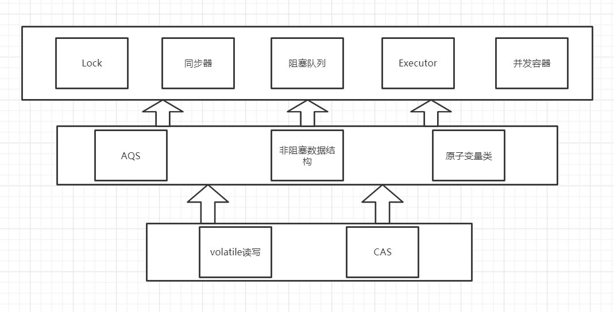
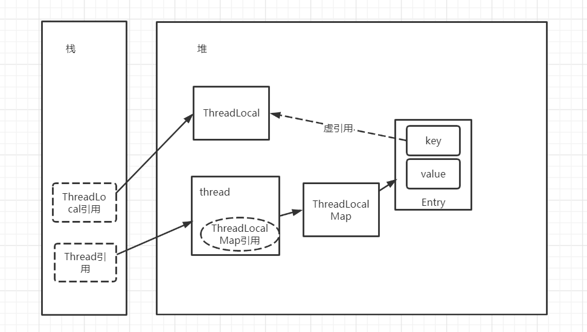
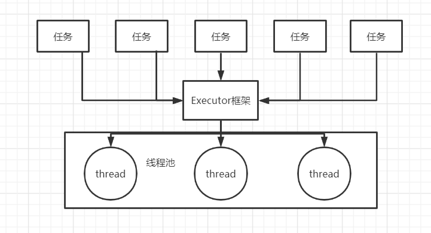
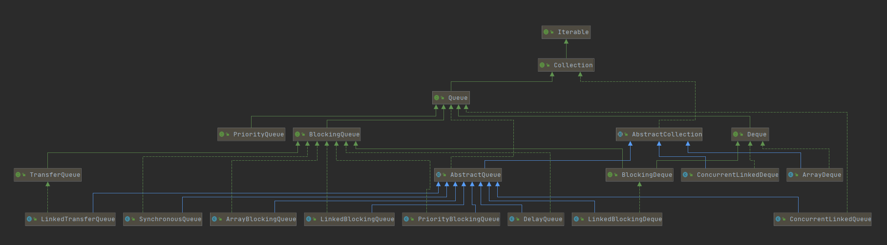
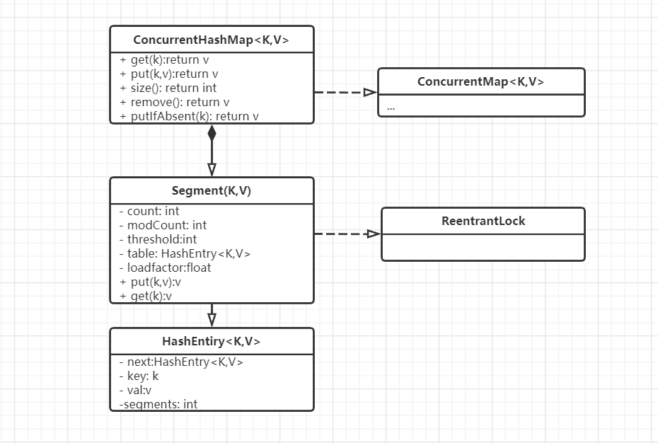
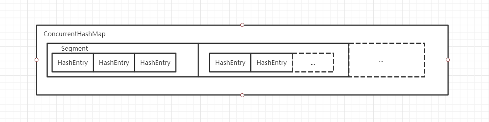

# Concurrent包

由于java的CAS同时具有volatile读和写内存语义. 因此java线程之间通信有四种方式

- **A线程写volatile变量, 随后B线程读这个volatile变量**
- **A线程写volatile变量, 随后B线程用CAS更新这个volatile变量**
- **A线程用CAS更新一个volatile变量, 随后B线程用CAS更新这个volatile变量**
- **A线程用CAS更新一个volatile变量, 随后B线程读这个volatile变量**

java的CAS会使用现代处理器上提供的高效机器级别的原子指令, 这些原子指令以原子方式对内存进行读-改-写操作, 这是多处理器中实现同步的关键. 
同时volatile变量的读/写和CAS可以实现线程之间的通信. 把这些特性整合到一起, 就形成了整个Concurrent包实现的基石. 看过Concurrent包源码后会发现, 有一个通用的实现模式.

首先, 声明共享变量为volatile. 

然后, 使用CAS的原子条件更新来实现线程之间的同步. 

同时, 配合以volatile的读/写和CAS所具有的volatile读写的内存语义来实现线程间通信. 

java中的AQS. 原子变量类, 非阻塞数据结构都是使用这种模式实现的. 而current包的高层类有依赖于这些基础类.



## ThreadLocal

ThreadLocal类能够使线程中的某个值与对象关联起来. 它提供了get与set等访问接口或方法, 这些方法为每个使用该变量的线程都存有一份独立的副本, 因此get总是返回由当前执行线程在调用set时设置的最新值. 最典型的情景时JDBC的连接对象.

```java 

    private static ThreadLocal<Connection> connectionHolder = new ThreadLocal<>(){
                                                                public Connection initiaValue(){
                                                                    return DriverManager.getConnection(DB_URL);
                                                                }
                                                              }
    public static Connection getConnection(){
        return connectionHolder.get();
    }                                                              
```

### ThreadLocal部分源码解读

---
```java 

public class ThreadLocal<T> {

    public void set(T value) {
        Thread t = Thread.currentThread();
        // 通过currentThread中threadLocalMap引用获取关联的Map
        ThreadLocalMap map = getMap(t);
        if (map != null)
            // 更新Map中的value
            map.set(this, value);
        else
            // 若ThreadLocalMap容器不存在则创建一个, 并将引用赋予currentThread
            createMap(t, value);
    }
    
    ThreadLocalMap getMap(Thread t) {
        return t.threadLocals;
    }
    
    public T get() {
        Thread t = Thread.currentThread();
        ThreadLocalMap map = getMap(t);
        if (map != null) {
            map不为空时, 以当前threadLocal实例为key获取数据
            ThreadLocalMap.Entry e = map.getEntry(this);
            if (e != null) {
                @SuppressWarnings("unchecked")
                T result = (T)e.value;
                return result;
            }
        }
        // 如果map为空, 初始化一下
        return setInitialValue();
    }
    
     public void remove() {
         ThreadLocalMap m = getMap(Thread.currentThread());
         if (m != null)
             // map不为空时以当前threadLocal实例为key移除数据
             m.remove(this);
     }    
}

public class Thread implements Runnable {
  ...
  // 当前线程关联的threadLocal引用
  ThreadLocal.ThreadLocalMap threadLocals = null;
  ...
}

```

### ThreadLocalMap

---

ThreadLocal并不是存储数据的容器, 它只是一个引用, 它的内部维护了一个ThreadLocalMap容器, 元素以ThreadLocal实例为key, 保存对象为value. ThreadLocalMap并没有实现Map接口, 而是自行实现了Map的功能.
它维护的Entry对象继承了WeakReference, 目的是将ThreadLocal对象的生命周期与Thread的生命周期解绑.

```java 
    static class ThreadLocalMap {
        
        ...
        
        static class Entry extends WeakReference<ThreadLocal<?>> {
            /** The value associated with this ThreadLocal. */
            Object value;

            Entry(ThreadLocal<?> k, Object v) {
                super(k);
                value = v;
            }
        }
        ...
    }    
```

### 内存泄露

---
**ThreadLocal的内存模型**



>ThreadLocalMap的以[弱引用](../jvm/gc.md###弱引用)方式引用者ThreadLocal, 因此如果ThreadLocal没有被ThreadLocalMap以外的对象引用时, 那么下次GC就会回收掉ThreadLocal, 此时ThreadLocalMap中一组键值对的Key就变成了null, 
>对应的value也没有办法被外部访问带, 而只要Thread又强引用了ThreadLocalMap, 若Thread实例没有被GC, ThreadLocalMap就不会被回收, key为null的value就会一直占用者内存. 此时就发生了内存泄露 
> 
>因此, 若ThreadLocal的线程还在运行时, 若数据不再使用, 要记得调用调用ThreadLocal的remove方法移除value.

### ThreadLocalMap的优化

---
```java 
        private Entry getEntry(ThreadLocal<?> key) {
            int i = key.threadLocalHashCode & (table.length - 1);
            Entry e = table[i];
            if (e != null && e.get() == key)
                return e;
            else
                return getEntryAfterMiss(key, i, e);
        }
        private void set(ThreadLocal<?> key, Object value) {

            ...
            for (Entry e = tab[i];
                ...
                if (k == null) {
                    replaceStaleEntry(key, value, i);
                    return;
                }
            }
            ...           
        }        
```
 ThreadLocalMap的set和getEntry方法中会对Key做null判断, 条件成立时会将value也置为null

## Executor

在JDK1.5之后, java将工作单元与执行机制分离开. 工作单元包括runnable和callable, 执行机制有Executor框架提供. 



java多线程程序把任务分解为多个任务, 然后使用Executor把这些任务映射为固定数量的线程.

Executor框架分为三部分:

- **任务**. 包括被执行任务需要实现的接口: Runnable或Callable.
- **任务的执行**. 包括任务执行机制的和新街口Executor, 以及继承了Executor的ExecutorService接口. Executor框架有两个关键类实现了ExecutorService接口(ThreadPoolExecutor和ScheduledThreadPoolExecutor)
- **异步执行结果**. 包括接口Future和实现类FutureTask.

Executors的工厂方法.
| 方法名| 描述|
| --- | --- |
| newFixedThreadPool| 创建一个固定长度的线程池, 每提交一个任务时就创建一个线程, 当到达长度时, 规模不再变化|
| newCachedThreadPool| 可缓存的线程池, 如果线程池的规模超过了处理需求时, 会回收空闲的线程, 当需求增加时, 会添加新的线程来处理需求, 线程池规模不存在限制|
| newScheduledThreadPool| 创建一个固定长度的线程池, 以延迟或定时的方式来执行任务|
| newSingleThreadPool| 单线程线程池, 可以确保依照任务在队列中的执行顺序(FIFO,LIFO,优先级)|


ExecutorService的方法
| 方法名| 描述| 
| --- | --- | 
|shutdown|平缓关闭, 不再接受新任务, 同时等待已提交的任务执行完毕, 包括还未执行的任务|
|shutdownNow| 立刻关闭, 并返回未执行的任务|
|isShutDown|当调用shutdown或shutdownNow后返回true|
|isTerminated| 调用shutdown后, 并且所提交的任务完成后返回true; 调用shutdownNot后, 成功停止后返回true|

关闭后提交的任务将由拒绝执行处理器来处理. 

### 延迟任务与周期任务

---
::: warning Timer
Timer在执行所有定时任务时只会创建一个线程, 如果某个任务的执行任务时间过长会影响其他TimerTask的定时精确性.

如果TimeTask抛出了一个未检查的异常, Timer不会捕获异常, 这时会终止定时线程, 并且不会恢复, 而是会错误的认为整个Timer都被取消了, 因此已经被调度但未执行的TimerTask将不会执行, 新的任务也不会被调度,
这种情况成为**线程泄露**
:::

ScheduledThreadPoolExecutor内部使用DelayQueue提供调度功能.

DelayQueue内部使用PriorityQueue存放数据, 使用ReentrantLock实现线程同步.DelayQueue中的每个元素都要实现Delayed接口, 每个Delayed对象都有一个相应的延迟时间. 
在DelayQueue中, 只有元素逾期之后, 才会被take.

```java 

        ScheduledThreadPoolExecutor executor = new ScheduledThreadPoolExecutor(2,runnable -> new Thread(runnable,"scheduled-thread-"));

        executor.scheduleAtFixedRate(() -> System.out.println("1秒之后开始执行; 下次任务执行时间 = 本次任务开始时间 + 1秒"),1000, 1, TimeUnit.SECONDS);
        executor.scheduleWithFixedDelay(() -> System.out.println("1秒之后开始执行;下次任务执行时间 = 本次任务结束时间 + 1秒"),1000,1,TimeUnit.SECONDS );
        executor.schedule(() -> System.out.println("一秒后执行一次任务"), 1000, TimeUnit.SECONDS);
        ScheduledFuture<String> future = executor.schedule(() -> {
            System.out.println("执行callable任务");
            return "success";
        }, 1000, TimeUnit.SECONDS);
        // 如果任务执行结束, 获取结果
        if (future.isDone()){
            System.out.println(future.get());
        }
    } 
```


DelayQueue中的PriorityQueue会对队列中的ScheduledFutureTask进行排序, 排序时, time小的排在前面, 任务优先执行, 如果time相等, 会将入队时间较早的task放在前面. 

当ScheduledThreadPoolExecutor中的某个线程取到并执行一个任务之后, 会把这个task的time变量修改为下次将要被执行的时间, 修改之后会将任务重新放回队列中.

### CompletionService

---
当提交一组计算任务, 并希望在计算完成后获得结果时可以使用CompletionService. 

CompletionService将Executor和BlockingQueue融合, 将Callable和Runnable提交过后, 使用类似于队列操作的take和poll来获得已完成的结果.

```java 
    @Test
    void test_completionService() throws ExecutionException, InterruptedException {

        ThreadPoolExecutor threadPoolExecutor = new ThreadPoolExecutor(0,Integer.MAX_VALUE,60 , TimeUnit.SECONDS, new SynchronousQueue<>());
        CompletionService<String> completionService = new ExecutorCompletionService<>(threadPoolExecutor);

        completionService.submit(() -> "success");
        completionService.submit(() -> "success");
        ...

        Future<String> future = completionService.take();

        assert Objects.equals(future.get(), "success");
    }
```

ExecutorCompletionService实现了CompletionService, 它在构造函数中创建一个BlockingQueue保存计算的结果, 当计算完成时调用FutureTask的done方法, 当提交任务时, 首先将任务包装为一个QueueingFuture, 它实现了
FutureTask, 并重写了done方法, 将结果放入BlockingQueue中. 多个ExecutorCompletionService可以共用一个Executor 


## Queue

Queue是JDK1.5之后出现的集合接口, 它用于保存一组待处理的有先后顺序的的数据.   

```java 
public interface Queue<E> extends Collection<E> {
    /**
     * 向队列的尾端插入一个元素, 当队列满导致插入失败时, 抛出一个IllegalStateExceltion
     */
    boolean add(E e);

    /**
     * 向队列的尾端插入一个元素, 当队列满导致插入失败时, 返回false
     */
    boolean offer(E e);

    /**
     * 返回并删除队列中的第一个元素, 当队列为空时, 抛出NoSuchElementException
     */
    E remove();

    /**
     * 返回并删除队列中的第一个元素, 当队列为空时, 会返回一个null
     */
    E poll();

    /**
     * 返回队列中的第一个元素, 不删除元素, 若队列为空时, 抛出一个NoSuchElementExceptoin
     */
    E element();

    /**
     * 返回队列中的第一个元素, 不删除元素, 若队列为空时, 返回一个null
     */
    E peek();
}
```



**常用的队列实现**

|类名| 描述|
|---|---|
|LinkedBlockingQueue| 链表结构的有界阻塞队列|
|ArrayBlockingQueue| 数组结构的有界阻塞队列|
|PriorityBlocking| 支持优先级排序的无界阻塞队列|
|SynchronousQueue| 同步移交队列, 不存储元素|
|LinkedTransferQueue|链表结构的无界阻塞队列|
|LinkedBlockingDeque| 链表结构的双向阻塞队列|
|ConcurrentLinkedDeque| 链表结构的线程安全的双向阻塞队列|

### BlockingQueue


---

BlockingQueue继承了Queue接口, 增加了可阻塞的获取和插入等操作, 当队列为空时, 将一直阻塞, 直到出现可用元素. 若队列已满, 插入操作将一直阻塞.

实现了BlockingQueue的LinkedBlockingQueue和ArrayBlockingQueue都是FIFO队列. 

**PriorityBlockingQueue**是优先级排列队列, 初始化时需要指定Comparator, 若没有指定, 操作的元素需要实现Comparable接口. 

**SynchronizedQueue**它不会为队列中的元素维护存储空间, 与其他队列不同的是它维护了一组线程, 因为没有存储功能, 所以put和take会一直阻塞, 直到有一个线程准备好参与到交付过程中. 
 

### Deque

---
Deque继承了Queue, 它是一个双向队列. 可以用于替代Stack. 由于Stack的实现继承了Vector, 加锁的粒度为方法级别. 效率过低. 并且基于数组实现, 而栈的特点是首位操作, 遍历情况少, 所以Stack类已经不推荐使用. 

Deque适用于工作取密模式. 解决即是生产者也是消费者的问题, 当发现新任务时, 将任务放到自己的队列的末端. 

::: tip LinkedList
LinkedList同时实现了List与Deque接口, 它的功能面是最全的
:::
## CopyOnWriteArrayList

CopyOnWriteArrayList在遍历操作为主要操作(读多写少)的情况下用于替代同步List, 提供更好的并发性能, 并且在迭代时不需要对容器进行加锁或复制.

如果有多个调用者同时要求相同的资源(如内存或者磁盘上的数据存储), 他们会共同获取相同的指针指向相同的资源, 直到某个调用者视图修改资源内容时, CopyOnWriteArrayList才会真正复制一份专用副本给调用者, 而其他调用者所见到的最初的资源仍然保持不变, 修改完成后会将原容器
的引用指向新容器.

因为CopyOnWrite的写时复制机制, 所以在进行写操作时, 内存里会同时驻扎两个对象的内存, 旧的对象和新写入的对象(在复制时只是复制容器里的引用, 只有在写的时候才会创建新的对象添加到新容器里, 而旧容器里的对象还在使用, 因此会有两份对象内存). 
如果写入对象占用的内存比较大, 比如说200M左右, 那么再写100M进去, 内存就会占用300M, 这是很可能造成频繁的YoungGC和FullGC.

同时由于读写分别在不同的容器上, 在写的过程中读不会阻塞, 但未切换到新容器引用之前, 是读不到刚写入的数据的. 
 
## ConcurrentHashMap


在并发变成中HashMap不能保证线程安全, 而使用线程安全的HashTable效率过于低下, 于是出现了ConcurrentHashMap, 它用于替代同步且基于散列的Map, 它采用分段锁来实现更大程度的共享. 

HashTable效率底下的原因是因为内部只有一把synchronized, 所有线程要去竞争. 而ConcurrentHashMap内部中有多把锁, 每一把锁用于锁容器其中一部分数据, 当多线程访问不同数据段的数据时, 线程间就不会存在锁竞争, 从而有效提高并发访问效率. 



CurrentHashMap有Segment数组结构和HashEntry数组结构组成. Segment继承了ReentrantLock. HashEntry用于存储键值对.Segment结构类似于HashMap, 是数组和链表结构. 一个Segment守护一个HashEntry数组里的元素. 
  
 

对一个HashEntry数组的数据进行修改时, 必须先获得与他对应的Segment锁.

::: tip ConcurrencyLevel

 ConcurrentHashMap初始化除initialCapacity与loadFactor之外还需要一个ConcurrencyLevel参数(预计的并发更新线程数), 这个参数用于决定segments数组的长度
::: 


## Fork/Join框架


## 闭锁

闭锁CountDownLatch是一种同步工具类, 用于确保某些活动直到其他活动都完成才执行. 如某个计算要在其所需的所有资源都被初始化之后才继续执行. 

```java 
    @Test
    public void test_countDownLatch() throws InterruptedException {
        
        final int threadNum = 10;
        final CountDownLatch startGate = new CountDownLatch(1);
        final CountDownLatch endGate = new CountDownLatch(threadNum);

        for (int i = 0; i < threadNum; i++) {
            
            new Thread(() -> {
                try {
                    // 等待startGate解锁
                    startGate.await();
                    try{
                        // 执行计算...
                        doSomething();
                    }finally {
                        // 表示一个计算已经结束
                        endGate.countDown();
                    }
                } catch (InterruptedException ignored) {
                }
            }).start();
        }

        long start = System.currentTimeMillis();
        startGate.countDown();
        endGate.await();
        long end = System.currentTimeMillis();
        System.out.println(end - start);
        
    }
```

闭锁状态包括一个计数器, 这个计数器被初始化为一个正数, 表示要等待的事件数量. countDown方法递减计数器, 表示一个事件已经发生, await方法等待计数器达到0, 若计数器非0, await将会一直等待. 

## FutureTask

FutureTask实现了Future语义, 也可以用作闭锁, 传递给线程的构造方法.

```java 
    
    public class Preloader{

        private final FutureTask<ProductInfo> future = 
                new FutureTask<ProductInfo>(() -> {
                    // 模拟从数据库加载数据
                    return loadProductInfo();
                });
        
        private final Thread thread = new Thread(future);
        
        // 单独定义start方法启动数据加载线程, 而不是在构造方法中启动, 防止this溢出
        public void start(){
            thread.start();
        }
        
        public ProductInfo get(){

            try {
                return future.get();
            } catch (InterruptedException | ExecutionException e) {
                ... 
            }
        }
    }

    @Entity
    public class ProductInfo{
//        ...
    }
``` 

Future.get行为取决于任务状态, 若任务已完成, get会立即返回结果, 否则将阻塞直到任务进入完成状态, 然后返回结果或抛出异常. 
## 信号量

信号量Semaphore中用来控制同时访问某个特定资源的操作数量, 或者同时执行某个操作的数据. 

信号量中管理着一组虚拟的许可, 许可的初始数量由构造方法指定, acquire方法会阻塞直到有许可可用, release方法将返回一个许可给信号量. 

信号量可以用作资源池, 如数据库连接池这类当池中资源为空时, 再请求资源不是失败而是阻塞. 

```java 
    // 借助Semaphore实现一个有界的HashSet
    public class BoundedHashSet<E> {
        
        private final Set<E> set;
        private final Semaphore sem;
        
        public BoundedHashSet(int bound){
            this.set = Collections.synchronizedSet(new HashSet<>());
            this.sem = new Semaphore(bound);
        }
        
        public boolean add(E e) throws InterruptedException {
            
            sem.acquire();
            boolean wasAdded = false;
            try{
                
                return wasAdded = set.add(e);
            }finally {
                if (!wasAdded){
                    // 添加失败时释放许可
                    sem.release();
                }
            }
        }
        
        public boolean remove(E e){

            boolean wasRemoved = set.remove(e);
            if (wasRemoved){
                // 释放许可
                sem.release();
            }
            return wasRemoved;
        }
    }

```
## 栅栏

栅栏CyclicBarrier类似于闭锁, 它能够阻塞一组线程直到某个事件发生, 栅栏与闭锁的区别在于所有线程必须同时到达栅栏位置才能够继续执行. 闭锁用于等待事件, 而栅栏用于等待其他线程. 

CyclicBarrier可以使一定数量的参与方反复在栅栏位置汇集, await方法将阻塞直到所有线程都到达栅栏位置, 当全部到达时, 将释放, 若await调用超时或await阻塞的线程被中断, 会认为栅栏被打破, 所有阻塞的await调用线程都将终止并抛出异常. 

比如说4个同事相约中午兰州大酒店, 12点之后都准备去吃饭了, 有一个突然说要大号, 另外三个同事都在等着, 大号的同事蹲了三分钟没有结束或者没带纸想要晾干再出来, 就跟另外三个同事说:别等了, 你们先走吧!

```java

public class CyclicBarrierTest{
    private fianl CyclibBarrier barrier;
    private final Worker[] workers;
    private final List<Thread> workers;
    public CyclicBarrierTest(){
    
        barrire = new CyclicBarrier(10);
        workers = IntStream.ofRange(0,10).mapToObj(i -> new Thread(() -> {
          String threadName = Thread.currendThread().getName();
          sout("线程等待者" + threadName + "到达位置");
          cd.await();
          sout(threadName + "等待结束");
        }, "worker-" + i)).collect(toList());
    }
    
    public void start(){
        workers.for(Thread::start);
    }
}
```
::: tip CountdownLatch与CyclicBarrier的区别
| CountdownLatch | CyclicBarrier|
|---|---|
| 当某个线程需要等待都其他线程到达某个时间节点后再启动时可以使用闭锁|当需要所有线程在同一时间一块启动时, 可以使用栅栏|
| CountdownLatch不可以复用, 递减计数为零后不能重新使用| CyclicBarrier可以复用, 递增到达最大技术之后可以重新计数|
| CountdownLatch基于AQS实现|CyclicBarrier基于ReetrantLock实现|
::: 
### Exchanger

---
双方栅栏, 各方在栅栏位置交换数据, 当两方执行不对称操作时, 如一条线程向缓冲区写入数据, 另一条读取数据, 两个线程可以使用Exchanger来会和, 并把写入的缓冲区和空缓冲区交换.    

