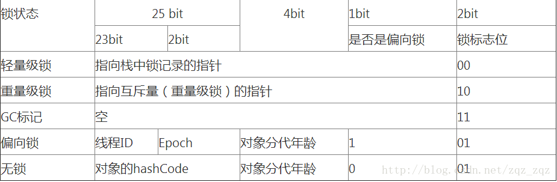
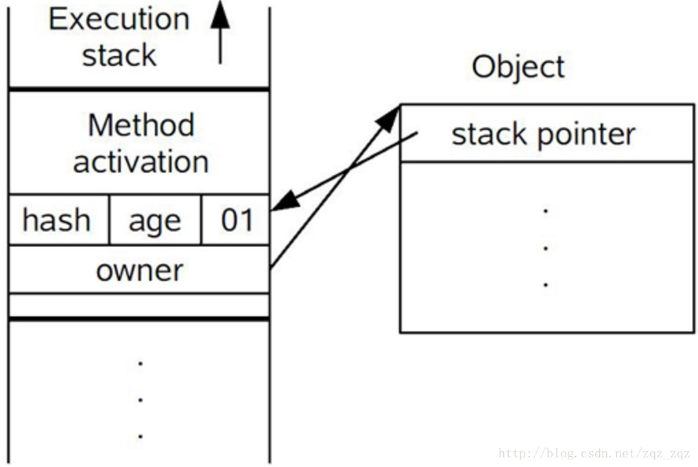

# synchronized与volatile的实现原理

## Synchronized

synchronized实现同步的基础是java中的每一个对象可以作为锁. 对于普通方法, 锁是当前实例对象; 对于静态方法, 锁是当前类的Class对象.
对于同步代码块, 锁是synchronized括号内配置的对象.

synchronized基于进入和退出Monitor对象来实现方法同步和代码块同步, 但两者的实现细节不一样, 代码块同步是使用monitorenter和monitorexit指令实现的. 
而方法同步使用另外一种方式实现, 细节在JVM规范里没有详细说明, 但方法同步同样可以使用这两个指令来实现. 

synchronized是支持重入的, 它会关联一个持有锁的线程ID以及一个计数器, 当一个线程请求加锁时, 会判断线程ID是否匹配, 如果匹配的话再次获取到锁,
然后将计数器加1, 当退出锁时, 会将计数器减1. 当计数器为0时, 表示没有线程持有锁.

monitorenter在编译后插入到同步代码块开始位置, monitorexit在编译后插入到代码块结束处和异常处. 

synchronized用的锁是存在java对象头里的markword中. 如果对象是数组类型, 虚拟机用3个字宽存储对象头, 如果对象是非数组类型, 使用两个字宽存储对象头.

在运行期间, markword里存储的数据会随着锁标志位的变化而变化. markword可能变化为存储以下4种数据.

  

## 锁升级
jdk1.6之后为了减少锁获取和释放带来的性能消耗. 引入了偏向锁和轻量级锁, jdk1.6中锁一共有4种状态: **无锁-> 偏向锁-> 轻量级锁-> 重量级锁**.
这几个状态随着竞争情况逐渐升级, 并且只能升级不可以降级.
### 偏向锁

如果在运行过程中, 同步锁只有一个线程访问, 不存在多线程竞争, 则不会触发同步, 这时会给线程加一个偏向锁. 

#### 偏向锁的获取

1. 访问markword中偏向锁的标志是否设置为01, 确认为偏向锁
2. 如果是可偏向状态, 测试线程ID是否指向当前线程, 如果是,执行步骤4
3. 尝试CAS操作竞争锁, 竞争成功后将线程ID设置为当前线程ID, 执行步骤4
4. 执行同步代码块

#### 偏向锁的释放

偏向锁只有遇到其他线程尝试竞争偏向锁时, 持有偏向锁的线程才会释放锁, 线程不会主动去释放偏向锁. 

偏向锁的撤销, 需要等待GC安全点(这个时间点上没有字节码正在执行), 它会首先暂停拥有偏向锁的线程, 然后检查持有偏向锁的线程是否活着, 如果线程不处于活动状态, 则将对象头设置为无锁状态.
如果线程仍然存活, 拥有偏向锁的栈将会执行, 遍历偏向对象的锁记录, 栈中的锁记录和对象头的markword要么重新偏向于其他线程, 要么恢复到无锁或者标记对象不适合作为偏向锁. 最后唤醒暂停的线程. 

#### 偏向锁关闭

jdk1.6和jdk1.7中偏向锁是默认启动的, 但它在应用程序启动几秒种后才激活, 可以使用jvm参数: -XX: BiasedLockingStartupDelay=0.
也可以使用-XX:UseBiasedLocking=false关闭偏向锁, 直接进入轻量级锁状态.

### 轻量级锁

#### 轻量级锁的获取

1. 进入同步代码块前, 如果同步对象锁为无锁状态, 虚拟机首先在当前线程栈帧中创建一个名为Displaced Mark Word, 用于存储锁对象的Mark Word的拷贝.
2. 将锁对象头的Mark Word复制到锁记录中.
> 每个尝试获取轻量级锁的线程都会执行1 2两个操作
3. 拷贝成功后, 尝试使用cas操作将锁对象的mark word替换为指向锁记录的指针. 并将锁记录的owner指针指向锁对象的mark word.
4. cas更新成功, 即代表持有了锁, 将锁的标志位设置为00
 
5. 更新失败时判断锁对象的markword是否已经指向了当前线程, 如果是, 直接执行代码块, 如果不是, 说明多个线程在竞争, 膨胀为重量级锁, 锁标志改为10,
mark word中存储的是指向重量级锁的指针, 后续线程都要进入阻塞, 当前线程尝试自旋回去锁

#### 轻量级锁的释放

轻量级锁解锁时, 会使用cas操作将displaced mark word 替换回锁的mark word. 如果成功, 则表示没有竞争发生, 如果失败, 表示当前锁存在竞争, 锁会膨胀为重量级锁.

因为**自旋**(空循环)会消耗CPU, 为了避免无用的自旋(比如获取所得线程被阻塞了), 一旦锁升级为重量级锁, 就不会再恢复到轻量级锁. 
当锁处于这个状态下, 其他线程试图获取锁时, 都会被阻塞住, 当持有锁的线程释放锁之后会唤醒这些线程, 被唤醒的线程会进行新一轮的争夺. 

### 锁获取的执行流程

1. 检测mark word里面是不是当前线程ID, 如果是, 表示当前线程处于偏向锁.
2. 如果不是, 则使用cas将当前线程的ID替换mark word, 如果成功啧标示当前线程获得偏向锁, 置偏向锁标志为01
3. 如果失败, 啧说明发生了竞争, 撤销偏向锁, 进而升级为轻量级锁.
4. 当前线程使用cas将对象头的mark word 替换为锁记录指针, 如果成功, 当前线程获得锁.\
5. 如果失败, 表示其他线程竞争锁, 当前线程便尝试使用自旋来获取锁.
6. 如果自旋成功仍然处于轻量级状态.
7. 如果自旋失败, 则升级为重量级锁

### 变量可见性

线程解锁前, 将共享变量的最新值刷新到主内存中;

线程加锁前, 清空工作内存中共享变量的值, 使用时需要重新从主内存获取.

### 有序性

见[JMM的顺序一致性模型](./jmm.md#jmm-seq-con)

## volatile

volatile可以看作是轻量级的synchronized, 他不会引起线程的上下文切换. 它不能保证原子性, 只保证可见性和单个读/写操作的原子性, 可见性是通过内存屏障实现的.

当发生写操作时, jvm会将当前处理器缓存的数据写回到系统内存(LOCK前缀的指令). 写回内存的操作会使其他cpu里缓存了该内存地址的数据无效. 

LOCK指令在执行期间相当于独占锁, 独占任何共享内存, 其他处理器在这期间不能访问缓存. 

### 实现

为了实现volatile的内存语义(实现happens-before), JMM限制了对volatile变量的处理器和编译器的重排序.

**当第一个操作是volatile读时, 不管第二个操作是什么, 都不能重排序**. 这个规则确保volatile读后面的操作不会重排序到volatile读之前.

**当第一个操作是volatile写, 第二个操作是volatile写, 不能重排序**.

**当第二个操作是volatile写时, 不管第一个操作是什么, 都不允许重排序**. 这个规则确保volatile写之前的操作不会被重排序到volatile写之后.

为了实现上述三个规格,  编译器在生成字节码时, 会在指令序列中插入内存屏障来禁止特定类型的重排序.  
>  volatile写的内存屏障插入: 普通读 -> 普通写 -> **StoreStore** -> volatile写 -> **StoreLoad** -> 普通读
>
>  volatile读的内存屏障插入: volatile读 -> **LoadLoad** -> **LoadStore** -> 普通读 
- 在每个volatile写的前面插入一个StoreStore屏障.
> 任意写 ; StoreStore; volatile写  保证volatile写不会重排序到其他写之前
- 在每个volatile写的后面面插入一个StoreLoad屏障.
> volatile写 ; StoreLoad ;  任意读 保证volatile写不会重排序到其他读后面, 这其实为了防止有可能的volatile读重排序到前面, 是JMM的保守策略
- 在每个volatile读的后面插入一个LoadLoad屏障.
> volatile读; LoadLoad ; 任意读 保证volatile读不会重排序到其他读操作前面. 
- 在每个volatile读的后面插入一个LoadStore屏障.
> volatile读 ; LoadStore ; 任意写 保证volatile读操作不会重排序到其他写后面

## 原子操作

cpu使用锁定总线和缓存锁定实现原子操作.

所谓总线锁就是使用处理器提供的一个**LOCK#** 信号, 当一个处理器在总线上输出LOCK#时, 其他处理器的请求将被阻塞住, 那么该处理器可以独占共享内存.

频繁使用的内存会缓存在处理器的L1,L2和L3高速缓存中, 那么原子操作可以直接在处理器缓存中进行, 并不需声明总线锁. 缓存锁定是指如果被缓存在处理器缓存中, 并且在LOCK操作期间被锁定,
那么当他执行锁操作回写道内存时, 处理器不再总线上声言LOCK信号, 而是修改内部的内存地址, 并允许他的缓存一致性机制来保证操作的原子性, 因为缓存一致性机制会阻止同时修改两个以上处理器缓存的内存数据, 
当其他处理器回写已被锁定的缓存行的数据时, 会使缓存失效.

java使用锁和循环CAS的方式来实现原子操作. 自旋CAS基本思路就是循环进行CAS操作直到成功为止. 它只能保证一个共享变量的原子操作.

::: tip ABA问题
A -> B -> A

添加版本号1A -> 2B -> 3A 
:::
