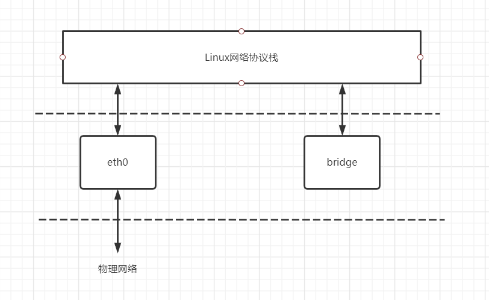
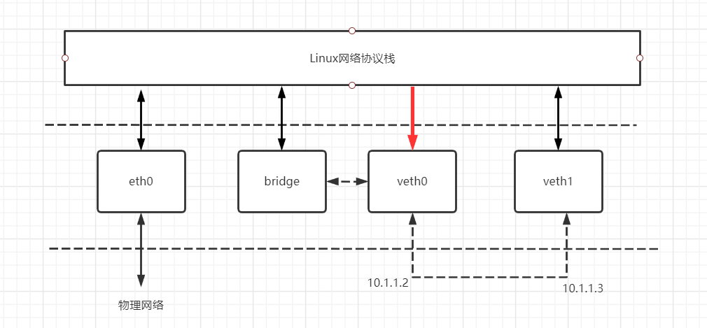
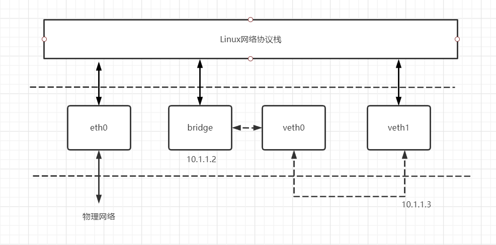
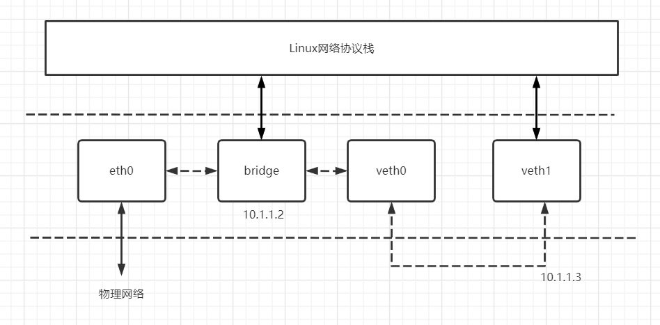
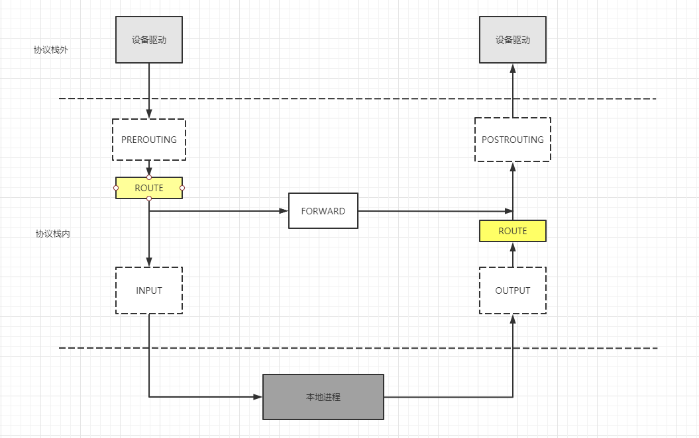
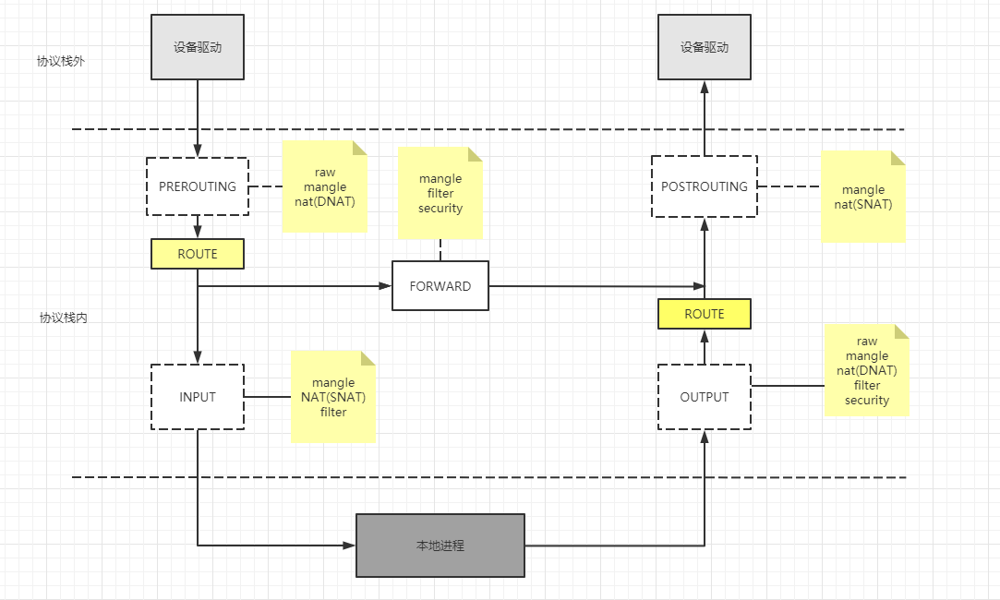
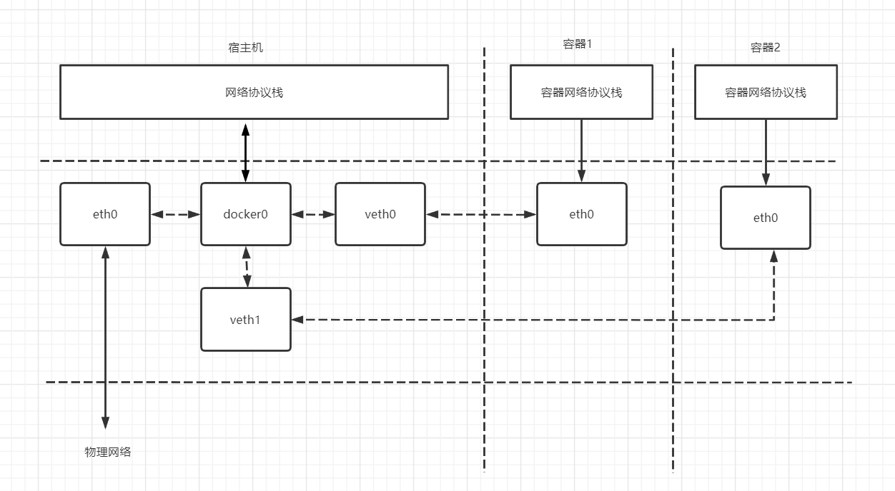

# k8s网络一: linux网络与docker网络模型

> k8s网络篇为Kubernetes网络权威指南笔记

k8s的网络依赖于容器, 容器的网络依赖于Linux内核支持. 所以需要先学习理解Linux相关的网络知识. 主要是`network namespace`, `veth pair`, `bridge`, `iptables`. 

## network namespace

linux的namespace用于隔离内核资源, 在linux中, 文件系统挂载点, 主机名, 进程PID数字空间, IP地址等全局系统资源被namespace分隔, 装到一个个抽象的独立空间中.
比如分隔文件系统挂载点的Mount namespace, 分隔进程PID的 PID namespace, 分隔网络的network namespace. 

对于进程来说, 想要使用namespace中的资源, 就要先进入到这个namespace中, 而且不能跨namespace访问资源. linux的namespace给里面的进程造成了两个错觉: 

- 它是系统中唯一的进程
- 它独享系统的所有资源 

默认情况下, linux进程处在和宿主机相同的namespace, 即root namespace, 默认享有全局系统资源. 

network namespace用于隔离linux的网络设备, 以及ip地址, 端口范围, 路由表, 防火墙规则等网络资源. 因此每个network namespace都有自己的网络设备.

```bash
[root@node1 ~]# ll /proc/16863/ns
total 0
lrwxrwxrwx 1 root root 0 Jun 11 11:20 ipc -> ipc:[4026531839]
lrwxrwxrwx 1 root root 0 Jun 11 11:20 mnt -> mnt:[4026531840]
lrwxrwxrwx 1 root root 0 Jun 11 11:20 net -> net:[4026531956] # 这里代表这个进程连接的network namespace
lrwxrwxrwx 1 root root 0 Jun 11 11:20 pid -> pid:[4026531836]
lrwxrwxrwx 1 root root 0 Jun 11 11:20 user -> user:[4026531837]
lrwxrwxrwx 1 root root 0 Jun 11 11:20 uts -> uts:[4026531838]
```
每一个linux进程都有一个属于自己的/proc/PID/ns目录, 这个目录下的每个文件都代表一个类型的namespace. 这些文件除了为进程提供关联namespace之外还有一个作用就是
只要这些文件描述符保持open状态, 对应的namespace就会一直存在, 哪怕这个namespace中的所有进程都终止运行了. 

除了使用文件描述符挂载的方式保存namespace存在, 还有一种方式可以保持namespace存在: **在namespace中放一个进程, k8s就是这么做的**.


## veth pair

单独创建的network namespace是无法与其他的network namespace之间通信的, 需要借助虚拟网卡. 


veth是虚拟网卡virtual ethernet的缩写. veth设备总是成对的, 因此称之为veth pair. veth pair一端发送的数据会在另外一端接收。 

因为veth pair都是一对一对出现的. 所以我们在部署过docker或k8s后在使用ifconfig查询网卡信息的时候总是会出现一大堆vethxxx之类的网卡名, 这些网卡都是veth pair在docker或k8s为容器而创建
的虚拟网卡, 一端在宿主机, 一端在容器内部.  

仅有veth pair设备, 容器是无法访问外部网络的, 因为从容器发出的数据包, 实际上是进入了veth pair设备的协议栈, 如果容器需要访问网络, 则需要使用**网桥**等技术将veth pair设备接收的数据包通过某种方式转发出去. 

## bridge

由于不同network namespace之间的路由表和防火墙规则也是隔离的, 所以从自定义的network namespace向公网发包也是发不通的. 常见的解决方法有网桥或NAT的方式. 

同时, 两个network namespace之间可以通过veth pair相互连接, 但是如果要做到两个以上的network namespace连接, veth pair就显得捉襟见肘了, 网桥也能够解决这个问题. 

网桥是一个二层虚拟网络设备, 可以理解为一个架设在linux系统中的交换机. 任何真实的物理设备(eth0)和虚拟设备(veth pair)都可以连接到网桥上面. **但网桥不能跨机连接网络**. 

Linux的网桥与虚拟网络设备不同之处在于普通的网络设备只有两端, 数据一端进, 一端出. 例如物理网卡从外网接收数据会转发给内核协议栈, 而从协议栈过来的数据会转发给外边的网络中. 
Linux网桥则有多个端口, 数据可以从任何端口进来, 进来之后从哪个口出去取决于目的MAC地址, 原理与物理交换机差不多. 



单独创建一个Linux bridge是没有任何实际功能的, 因为他只有一个端口连接着协议栈, 只是一个独立的网络设备. 所以网桥一般都是结合veth pair使用. 



veth设备的两端都可以配置IP, 并且两端可以直接ping通. 但是将veth设备的一端veth0连接到网桥上面之后, veth0就ping不通veth1了. 

这是因为veth0与协议栈之间的双向通道变成了单通道, 协议栈能发数据给veth0, 但是veth0从外面收到的数据不会转发给协议栈. 而bridge与veth0之间连接起了双向通道, 
且bridge的mac地址变成了veth0的mac地址. 这就好像bridge在veth0和协议栈之间做了一次拦截, 在veth0上面做了点小动作, 将veth0本来要转发给协议栈的数据拦截, 全部转发给bridge.

通过上述分析可以发现, 给veth0配置IP是没有意义的, 因为就算协议栈串数据包给veth0, 回程报文也回不去. 所以干脆将veth0的ip给bridge. 



这样将veth0与协议栈的联系去掉, veth0就变成了一根网线. 这时候通过bridge去ping veth1就通了, 但是ping网关还是不通的. 因为现在bridge上只知道veth设备的存在, 不知道eth0的存在. 

bridge是不会区分接入的是物理设备还是虚拟设备的, 因为对他来说没有区别. 所以将eth0加入到bridge之后会跟veth0一样, 从外面网络接收到的数据包全部无条件转发给br0, 自己变成了一根网线. 

这时候通过eth0ping网关也是失败的, 而bridge通过eth0这跟网线连接上了外面的物理网络, 所以连接在bridge上的设备都能ping通网关(bridge自己和veth1).

再让eth0ping通网关同操作veth0一样, 将eth0的ip删掉就可以了.
> 原来的默认路由是进eth0的, 现在eth0的被删了, 默认路由不见了, 所以想要连接10.1.1.0/24之外的网络时, 需要手动将默认网关添加回来. 



## iptables

iptables在docker和k8s中应用广泛, 在docker中做容器的端口映射; 在k8s中Service的默认模式, 网络策略都是通过iptables实现的. 


### 五个钩子

iptables的底层是netfilter. netfilter是一个通用的抽象的框架, 提供一套钩子函数式的管理机制. 它在整个网络流程的若干位置放置一些钩子, 并且在每个钩子上挂载一些处理函数进行处理.
> 典型的模版方法模式的应用. 

ip层的五个钩子的位置, 对应iptables五条内置链, 分别是PREROUTING, POSTROUTING, INPUT, OUTPUT和FORWAD.



- PREROUTING 

当网络设备收到一个包并送到协议栈时, 会先经过PREROUTING钩子, 如果这个钩子上有挂载钩子函数, 那么内核将在这里对数据包进行**目标地址转换DNAT**

- FORWARD 

不管在PREROUTING又有做过DNAT, 内核都会通过查本地路由表决定这个数据包是转发给本地进程还是发送给其他机器.  

如果是发送给其他机器或者其他network namespace, 就相当于把本地当做路由器, 就会经过netfilterFORWARD钩子. 在这个钩子上可以设置**过滤函数.**

- POSTROUTING

所有马上要发送到协议栈外的包都会经过POSTROUTING钩子, 在这个钩子上可以挂载**源地址转换(SNAT)** 或**源地址伪装(Masq)** 的钩子函数.

- INPUT 

如果经过路由决策, 内核决定把包发送给本地进程, 就会经过INPUT钩子

- OUTPUT

本地进程收到数据包后, 回程报文会先经过OUTPUT钩子, 然后经过一次路由决策, 最后出协议栈之前经过POSTROUTING


iptables是用户空间的一个程序, 通过netlink和内核的netfilter框架打交道, 负责往钩子上配置回调函数. 

### iptables5*5

iptables5*5指五张表和五条链, 

五条链指iptables的五条内置链, 对应上面五个钩子. 

- INPUT链: 用于处理输入本地进程的数据包;
- OUTPUT链: 用于处理本地进程的输出数据包;
- FORWARD链: 用于处理转发到其他机器或本机的其他network namespace的数据包;
- PREROUTING链: 在此处进行DNAT;
- POSTROUTING链: 在此处进行SNAT或Masp;

> 除五条链之外, 还可以自定义链

五张表会挂到链上, 表用来分类管理iptables规则. 五张表如下:

- raw表: iptables是有状态的, 即iptables对数据包有连接追踪机制, 而raw用来出去这种追踪机制. 
- mangle表: 用于修改数据包的ip头信息
- nat表: 用于修改数据包的源和目标地址
- filter表: 用于控制到到某条链上的数据包是否继续放行, 还是丢弃或者拒绝. 
- security表: 用于在数据包上应用selinux

并非每条链上都可以挂表. 表与链的对应关系如下



表中的规则就是挂在钩子上的函数, 用来修改数据包的内容或过滤数据包, iptables的表就是所有规则的5个逻辑集合. 

iptables的规则包含两部分: **匹配条件和动作**. 匹配条件即匹配数据包被这条规则捕获的条件, 如协议类型, 源ip, 目标ip, 源端口, 目标端口, 连接状态等. 

条件匹配后, 要执行的动作主要有以下几种:

- DROP: 丢弃数据包, 不做后续处理. 应用场景是不让某个数据源意识到你的系统存在, 模拟宕机.
- REJECT: 向客户端返回一个connection refused. 应用场景是不让某个数据访问你的系统, 告诉他这里没有你要的服务内容.
- QUEUE: 将数据包放入用户空间的队列, 供用户空间的程序处理. 
- RETURN: 跳出当前链, 不再执行后续规则
- ACCEPT: 同意数据包通过, 继续执行后续规则. 
- JUMP: 跳转到其他用户自定义链继续执行


### DNAT

DNAT根据指定条件修改数据包的目标IP地址和目标端口. 

```sh 
iptables -t nat -A PREROUTING -d 1.2.3.4 -p tcp --dport 80 -j DNAT --to-destination 10.20.30.40:8080
``` 

上面的命令解释如下

- -A PREROUTING: 表示以追加(Append)的方式增加这条规则. 这里意思是挂载到PREROUTING上. 
- -d 1.2.3.4 -p tcp --dport 80: 表示匹配目标地址端口为1.2.3.4:80的tcp包
- -j DNAT: 表示进行目标网络地址转换
- --to-destination: 表示将这个包的目标地址和端口修改为10.20.30.40:8080, 但不修改协议

**docker容器端口映射原理都是在本地的iptables的nat表中添加相应的规则, 将访问宿主机IP地址:hostport的包进行一次DNAT, 转换为容器IP: containerport.**

**而容器访问外网时, docker则会在POSTROUTING链上创建一条Masq规则, 用宿主机的IP地址替换掉源地址.**
## Docker网络模型

### 四种模式

Docker有四种网络模式:

- host

容器没有独立的网络命名空间, 和宿主机共用命名空间.
- container

与已经存在的容器共享网络命名空间, 而不是与宿主机共享
- none

容器有自己的网络命名空间, 但没有任何的网络配置, 没有网卡, ip, 路由等信息.
- bridge

这个模式是docker经典的组网模式. veth pair + bridge. 容器有独立的网络命名空间, 并将容器连接到一个虚拟网桥docker0上. 

**容器中的eth0网卡实际上和宿主机上的某个veth是成对的关系**. docker将在挂载在容器中的veth一端命名为了eth0.



### docker0

bridge模式下的每个容器都会创建一个虚拟的Veth设备对, 一端连接到docker0上, 另一端映射到容器的eth0设备. 然后从docker0的地址段内给eth0接口分配一个IP地址. 


bridge模式下, docker-daemon首次启动时会创建一个docker0虚拟网桥, 然后给这个网桥分配一个子网. 并给他一个IP地址, 通常172开头. 这个地址与宿主机的IP不重叠. 
IP3和IP4是Docker启动容器时, 在这个地址段选择的一个没有使用的IP地址分配给容器.

一般情况下在容器网络的外面是看不到IP2,3,4的.  也就是一台机器上的容器之间可以相互通信, 不同机器上的容器不能相互通信. 因为他们可能是在相同的网络地址范围内. 

### CNM

容器生态中有两种主流的网络接口方案, 分别是CNM(Container Network Model) 和CNI(Container Network Interface). CNM早于CNI出现, 
docker使用的是CNM, k8s使用的是CNI.

CNM中主要有三个概念. 

- **Network Sandbox**: 容器网络栈(网卡, 路由表, DNS配置). 对应的技术实现是network namespace, 一个Sandbox中可能包含多个网络的多个Endpoint.
- **Endpoint**: Endpoint作为Sandbox接入Network的**介质**, 是Network Sandbox和Backend Network的中间桥梁. 对应的技术实现有veth pair.
- **Backend Network**: 一组可以直接相互通信的Endpoint集合, 对应的技术实现是Linux bridge.

CNM和CNI目标都是以一致的编程接口抽象网络实现. CNM现在已经不是主流, 未来还是要看CNI.

---

由于Linux bridge + iptables的单机部署的网络方式, 容器只在主机内部可见, 如果要在实现不同主机间的相互通信还需要借助一些插件比如flannel, calico. 后面会再写 
