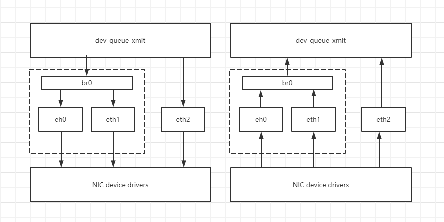
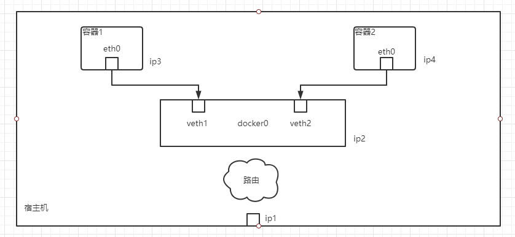
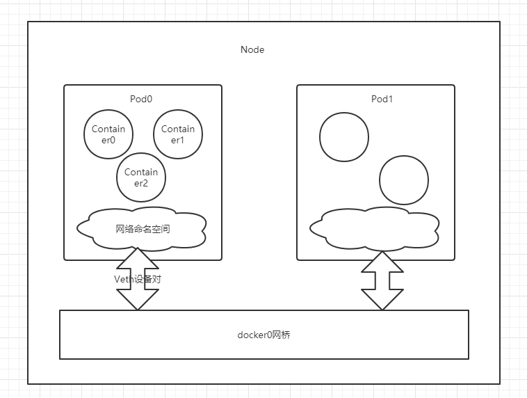
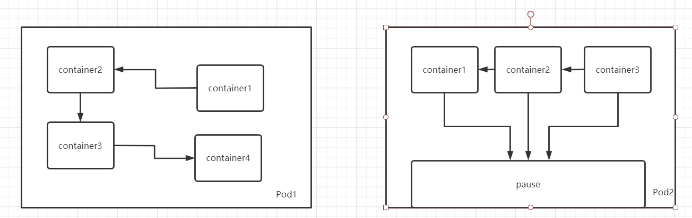

# k8s进阶一: 网络

在上篇文章中我们已经知道, k8s的每个Pod都有一个独立的IP, 并且不论是否运行在那个Node中, 每个Pod之间都可以通过对方的IP来进行通信. 在这个原则下, 我们不需要额外的考虑如何
去建立Pod之间的连接, 也不需要考虑容器的端口映射问题. 

## IP-per-Pod

基于上述原则, k8s抽象出一个IP-per-Pod模型. 这个模型中, IP以Pod为单位进行分配, Pod内的所有容器共享一个网络堆栈(相当于一个命名空间, 他们的IP地址, 网络设备, 配置都是相同的).
Pod的IP和端口在Pod的内部和外部都保持一致, 也就不需要NAT来进行地址转换了. 同时同一个Pod内的容器因为共享网络命名空间, 可以直接通过localhost来相互连接.

在IP-per-Pod模型下. 可以有效的利用各种域名解析和发现机制.

IP-per-Pod模型消除了Docker中的动态端口映射所带来的复杂性. 
> 在Docker的动态端口映射模式中, 因为NAT的原因访问者看到的IP端口与服务提供者实际绑定的IP端口是不一样的. 容器内应用是很难知道自身对外暴露的真实的IP和地址的. 外部应用也不能直接通过服务所在容器的私有IP和端口来访问服务.

在IP-per-Pod模式下, 一个Pod就好像一台独立的机器一样, 有自己的域名解析, 端口分配, 负载均衡, 服务发现机制. 

## Linux相关

k8s的网络依赖于Docker, Docker的网络依赖于Linux内核支持. 所以需要先学习理解Linux相关的网络知识. 主要是`Veth设备对`, `网络命名空间`, `网桥`. 

### 网络命名空间

不同的网络命名空间如同平行宇宙完全隔离, 彼此不能通信, 有自己的网络设备(物理或虚拟接口, 网桥都是网络设备). 

物理设备只能关联到root命名空间, 虚拟设备则可以关联到自定义命名空间, 并且可以在命名空间之间移动. 

### Veth设备对

Linux使用Veth设备对在两个不同的网络命名空间之间通信, 就像对讲机一样

### 网桥

网桥是一个二层虚拟网络设备, 可以理解为一个架设在linux系统中的交换机. 

网桥将多个网络连接到一起, 并且还有MAC地址学习功能, 可以通过收发报文中的MAC地址与自己记录的MAC表决定报文的转发网络接口. 

网桥有一个明显得特性是他还具备一个IP地址. 

上图中br0是网桥设备, 它绑定了eth0和eth1. 对于网络协议栈的上层来说, 只看到br0就可以, 因为桥接是在数据链路层实现的. 上层不需要关心桥接的细节. 所以协议栈上层需要发送的
报文被发送到br0, 网桥设备的处理代码判断报文该被转发到eth0还是eth1, 或两者都转发; 反过来, 从eth0或eth1接收到的报文被提交给网桥的处理代码. 网桥会判断报文应该被转发, 丢弃还是提交到上层协议中.

## Docker网络

Docker有四种网络模式:

- host

容器没有独立的网络命名空间, 和宿主机共用命名空间.
- container

与已经存在的容器共享网络命名空间, 而不是与宿主机共享
- none

容器有自己的网络命名空间, 但没有任何的网络配置, 没有网卡, ip, 路由等信息.
- bridge

容器有独立的网络命名空间, 并将容器连接到一个虚拟网桥docker0上

### docker0

虚拟网桥docker0类似交换机, 所有运行的容器通过这个交换机运行在一个二层网络中, 并在这个二层网络中分配IP. 

bridge模式下的每个容器都会创建一个虚拟的Veth设备对, 一端连接到docker0上, 另一端映射到容器的eth0设备. 然后从网桥的地址段内给eth0接口分配一个IP地址. 
> docker的实现中, 除了将Veth设备对一端放到容器中, 还把这一端的名字改为了eth0

bridge模式下, docker-daemon首次启动时会创建一个docker0虚拟网桥, 然后给这个网桥分配一个子网. 并给他一个IP地址, 通常172开头. 这个地址与宿主机的IP不重叠. 
IP3和IP4是Docker启动容器时, 在这个地址段选择的一个没有使用的IP地址分配给容器.

一般情况下在容器网络的外面是看不到IP2,3,4的.  也就是一台机器上的容器之间可以相互通信, 不同机器上的容器不能相互通信. 因为他们可能是在相同的网络地址范围内. 

为了让容器能够跨宿主机通信, 就必须在宿主机上分配端口, 然后通过这个端口路由或者代理到容器上. 而协调端口分配是十分复杂的, 特别是在集群水平扩展时. 

## k8s网络模式

k8s的同个Pod内的容器之间因为共享网络命名空间, 所以对网络的各种操作就好像在同一台机器上一样. 这里主要记录Pod之间的通信.

### 相同节点上的Pod通信

同一个节点上的Pod都是通过Veth设备对连接到同一个docker0上的, 他们的IP也都是从docker0的网段上获取的, 与网桥本身的IP属于同一个网段. 另外, Pod的默认路由也都是docker0的地址, 
也就是所有非本地地址的网络数据都会被默认转发到docker0上, 然后由docker中转出去. 

### 不同节点上的Pod通信

docker0网桥的网段和宿主机的网段是不同的, 所以不同节点上的Pod通信要想办法通过宿主机IP进行寻址通信.

1. k8s的网络模型要求Pod之间使用私有IP通信. 所以Pod的IP是不能冲突的, 因此k8s做了两点工作:

    1. 每个分配给Pod的IP都会被k8s记录并被存储到etcd中.
    2. 在部署k8s时会规划docker0的ip, 保证所有节点的docker0不冲突

2. Pod的IP要与node的IP相关联. 这一点可以使用一些开源的组件来完成比如flannel. 

### 通过service通信

部署一个service会导致iptables中添加一条规则记录, 这个规则将所有的报文的目标IP为ServiceIP的报文都重定向到一个本地的随机端口. 

随即端口是kube-proxy为每个创建的service指定的. 并且kube-proxy会监听那个端口, 为其创建相关的负载均衡对象. 

kube-proxy会维护两个TCP连接, 一个容器的proxy的, 和kube-proxy到负载均衡的目标Pod的.

### pause容器

每启动一个Pod, 都会在Pod中同时启动一个k8s.gc.io/pause容器, 这个容器使用bridge模式, 而任务容器使用container模式与pause容器相连. 

为什么使用这种方式呢? 

如果Pod启动多个容器的话, 而且容器有依赖关系. 比如Pod1, 那么如果container4挂掉了, 其他三个容器也会同时挂掉. 使用同pause容器可以解决这个问题. 

而且使用pause基础容器来执行端口映射, 其他容器连接到pause容器上的方式也简化了端口映射的过程. 

任务容器的IP数据流的网络目标都是这个pause容器, 但这个pause容器并不担任流量转发的工作, 实际上任务容器直接监听了对应的端口(他们是相同的命名空间), pause容器自身没有监听端口. 他只是接管了这个Pod的endpoint.

