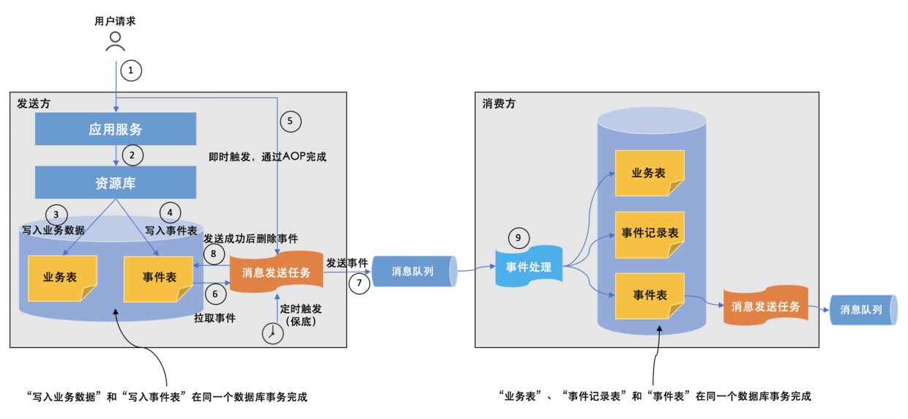

# DDD的战术设计

DDD的战术设计使业务从技术中分离出来, 让代码直接表达业务本身. 其中包含了应用服务, 聚合, 资源库, 工厂等概念.
面向对象的基本原则([SOLID](https://en.wikipedia.org/wiki/SOLID))在DDD中依然成立.

## 聚合

所谓聚合, 即将领域中高度内聚的概念放到一起组成一个整体, 聚合中的对象的生命周期
是同步的. 例如订单是一个聚合, 当删除一个订单使, 关联的订单项也应该一起删除, 订单项的存在依赖于订单的存在. 这样的业务逻辑是
一致的和完整的, 游离的订单项对我们来说没有意义, 除非有特殊的业务需求存在. 

## 聚合根

聚合中需要一个代表负责和全局通信, 类似一个部门的接口人, 这样就能确保数据保持一致, 我们把这个模型叫做聚合根. 
当一个聚合的业务足够简单时, 聚合可能只有一个模型组成, 这个模型就是聚合根, 常见的类似配置,日志相关的. 
聚合根是主要业务的承载体, 业务划分的根基, DDD中的所有战术实现都围绕聚合根展开. 聚合根即是软件模型中那些最重要的
以名词形式存在的领域对象, 例如:Order,Product. 同时聚合根要提防上帝对象, 即一个大而全的领域对象实现所有业务功能

**聚合根的特点:**
- 实现与框架无关, 最好是pojo类(但这其实很难做到)
- 聚合根之间通过id引用
- 为保证聚合的一致性, 聚合根内部变更要在内部完成, 避免逻辑泄露
- 一个事务只更新一个聚合根, 如果一个事务更新多个聚合根, 要先确定聚合根边界是否有问题, 如果是业务所需, 可以考虑引入消息机制和事件驱动
- 聚合根不引用基础设施层, 如资源库
- 外接不应该持有聚合根内部的数据结构
- 聚合根应该尽量的小

## 实体与值对象

聚合中相对于非聚合根的模型, 称之为实体, 实体表示那些具有生命周期并且会在其生命周期中发生改变的东西, 
其实聚合根本质上也是实体, 同属于领域模型, 用于承载业务逻辑和系统状态. 值对象则表示起描述性作用的并且可以相互替换的概念. 
同一个概念, 在一个软件系统中被建模成了实体, 但是在另一个系统中则有可能是值对象. 比如货币, 在通常交易中, 我们都将它建模成一个值对象,
因为我们只关心货币的数量而已, 而不是关心具体使用了哪种货币, 也就是说货币是可以互换的. 但是, 如果是为银行开发的系统, 需要管理所有发行的
货币, 并对没张货币进行跟踪, 那么此时货币便成为了一个实体, 并具有唯一标示.

**实体与值对象的区别**

|实体|值对象|
|----|----|
|id有意义|id无意义|
|有自己的生命周期|一经创建就不会修改|
|可以对实体进行管理|使用新的值对象替换|
|使用ID进行相等比较|使用属性进行相等比较|

##资源库

资源库用于持久化和获取聚合根, 与DAO不同的是, DAO只是对数据库的一层很薄的封装, 而资源库更具有领域特征. 
此外所有的实体都可以有响应的DAO, 但不是所有实体都有资源库, 只有聚合根才有资源库. 

##工厂

当聚合根创建无复杂逻辑时, 可以直接在聚合根中实现factory方法; 有复杂逻辑时, 或者创建逻辑不适合放在聚合根上时, 
则需要创建单独的工厂类. 工厂有将聚合根创建逻辑凸显得效果. 

## 应用服务

应用服务在代码中可以理解为传统的service层, 它采用门面模式, 使领域模型向外提供业务功能

- service的实现遵循一个原则, 即一个业务用例对应service中的一个业务方法
- service与事务意义对应, 即每个业务用例拥有自己的事务边界
- service本身不包含业务逻辑, 业务逻辑应该有限存放在聚合根中
- service与UI和通信协议无关, 他只是作为领域模型的一个门面, 各个适配器作为service的调用者处理通信协议并直接与客户端交互
- service作为领域模型的调用方, 领域模型的实现细节对其来说是一个黑盒
- service接收的请求对象中的数据应该仅仅用于描述本次业务本身, 尽可能的简单

## 领域服务

当发现有些领域概念放在实体上不合适, 放在值对象也不合适时, 就可以使用领域服务来进行处理, 比如
手机号校验, 密码加密, 微信登陆认证, 都可以单独创建一个DomainService来专门负责. 

领域服务与应用服务不同, 领域服务是领域模型的一部分, 而应用服务不是, 应用服务是领域服务的客户, 他将领域模型变成外接可用的软件系统. 
领域服务不能滥用, 如果过多的领域逻辑放在领域服务上, 实体和值对象将变成贫血对象. 

## 领域事件

领域事件用于捕获领域建模中发生过的事情. 它可以解耦限界上下文, 也可以借此来实现事件溯源与CQRS. 应用领域事件的服务见不再是强一致性,
而是最终一致性. 

**事件风暴**

类似于头脑风暴, 目地是通过领域事件识别出聚合根, 从而进行事件的限界上下文划分. 

1. 头脑风暴(识别领域事件)
2. 识别事件的触发器
3. 识别聚合(识别那些使用命令的聚合并发出相应的事件)

**领域事件与编码**

可以采用基类抽取事件的共有属性, 其中抽取出的id可以用于事件溯源和日志, 因为领域事件描述的是已经发生过的事, 因此领域事件应该是final的.

```
    
    @JsonTypeInfo(use = NAME, include = EXISTING_PROPERTY, property = "_type", visible = true)
    public abstract class DomainEvent {
        private final String _id;
        private final String _type;
        private final Date _createdAt;
    
        @JsonCreator
        protected DomainEvent(@JsonProperty("_id") String _id,
                              @JsonProperty("_type") String _type,
                              @JsonProperty("_createdAt") Date _createdAt) {
            this._id = _id;
            this._type = _type;
            this._createdAt = _createdAt;
        }
    
        protected DomainEvent(String _type) {
            this._id = gen32();
            this._type = _type;
            this._createdAt = new Date();
        }
    
        // ...
    }
    
    @Getter
    public class DeviceCreatedEvent extends DomainEvent {
    
        private final String tenantId;
    
        private final String groupId;
    
        private final String uniqueCode;
    
        private final String deviceId;
    
        public DeviceCreatedEvent(Device device) {
            super(DEVICE_CREATED);
            this.tenantId = device.getTenantId();
            this.groupId = device.getDeviceGroupId();
            this.uniqueCode = device.getUniqueCode();
            this.deviceId = device.getId();
        }
    }

```

**领域事件发布**

领域事件的发布通常采用发布-订阅的方式来进行, 为保证事件的正确发布, 事件可以临时保存在聚合根中, 在持久化聚合根时进行发布, 然后清空.

采用事件表的领域事件发布方式[EventBus](https://github.com/ytg2097/spring-coud-quick-starters/tree/master/iot-starter-eventbus):
1. 在更新业务表的同时，将领域事件一并保存到数据库的事件表中，此时业务表和事件表在同一个本地事务中，即保证了原子性，又保证了效率. 
2. 在后台开启一个任务，将事件表中的事件发布到消息队列中，发送成功之后删除掉事件

