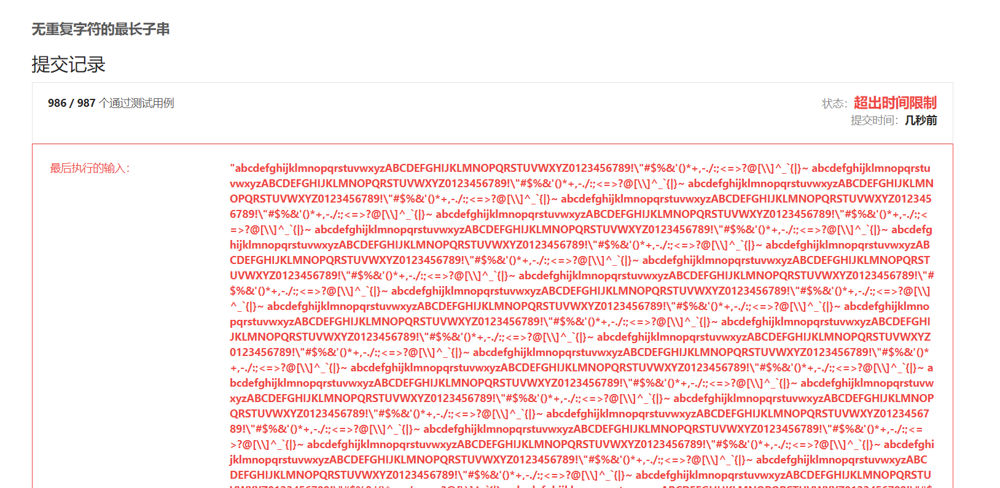
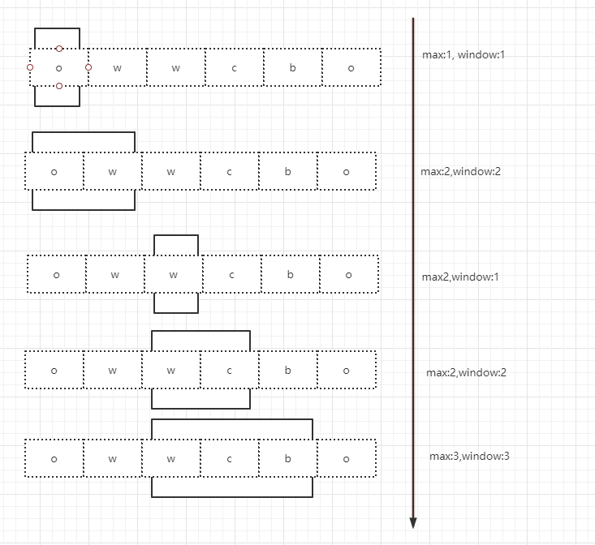

# 最大不重复子串的长度

## 描述

**给一个字符串, 找出其中最长的不重复子串的长度.** 这是一道很经典的面试题. 原来一直不会做, 最近开始刷leetcode看到了, 记录一下解题思路 

示例1 : 

    输入: owwcbo
    输出: 3
    解释: 最大不重复子串为wcb, 长度为3

示例2 :

    输入: uvhrtserewqc
    输出: 7
   
## 暴力解题

关键字: **不重复 -&gt; hash**, 取出每个字符与字符串中的其他字符依次比较, 直到遍历到最后一个

```java

public class Solution1{
    
    @Test
    public void test(){
    
        String case1 = "owwcbo";
        String case2 = "quuqsd";
        
    }
    
    public int process(String str){

        int len = str.length();
        int result = 0;
        for(int i = 0; i < len; i++){

            for(int j = 0; j <= len; j++){

                boolean b = assertNotRepeat(str,i,j);

                if (b){
                    result = Math.max(result, j - i);
                }
            }
        }
        return result;
    }

    public boolean assertNotRepeat(String str, int start, int end) {

        Set<Character> set = new HashSet<>();

        while (start < end){
            Character c = str.charAt(start++);
            if (set.contains(c)){
                return false;
            }
            set.add(c);
        }
        return true;
    }
}
```

本地测试没有问题, 但是当在leetcode提交时没有通过测试最后一个测试用例. 因为上面的代码循环过多, 导致复杂度过高

## 滑动窗口

滑动窗口就像放大镜一样, 这个窗口的大小可以是固定的, 也可以是动态调整的. 它只操作目标在窗口内的部分, 而不是操作目标的整体. 降低了循环的深度. 滑动窗口算法主要应用在数组和字符串上. 



接下来用代码实现:

```java 
public class Solution2{

    ...
    private int process(String str) {

        // 使用hashmap来存储字符与它在字符串中的角标 
        Map<Character,Integer> map = new HashMap<>();
        
        int left = 0, right = 0, max = 0;

        while (right < str.length()) {
            
            if (map.containsKey(str.charAt(right))){
              
                left = Math.max(left, map.get(str.charAt(right)) + 1);
            }
            
            map.put(str.charAt(right),right); 
            
            max = Math.max(max,right - left + 1);
            
            right++;
        }
        return max;
    }
}
```
使用双指针实现滑动窗口, left指针为窗口的左窗沿, right为右窗沿. 在出现重复字符之前, right指针会一直前移, left指针不会移动.

最大不重复子串的长度``max = right - left + 1``

当出现重复字符后, left指针要向前移动到重复字符的前边 

在这个算法中, 最主要的是怎么去移动left. 

以owwcbo为例, 当right移动到角标2时, 当前的最长不重复子串是ow, 当前字符是w, 发现w已经在map中存在， 那么更新一下``left = map.get(w) + 1``. 而后重新计算``max. max = Math.max(max,right - left + 1) ``


