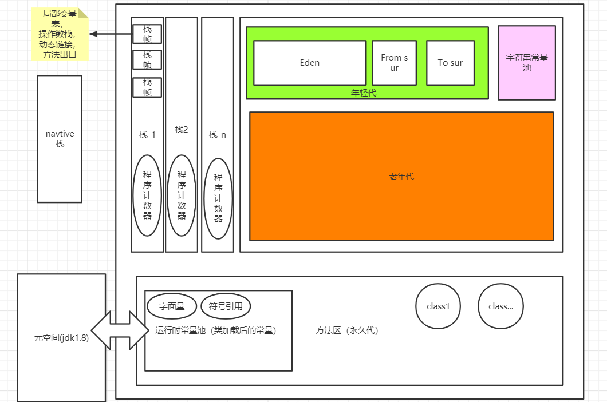
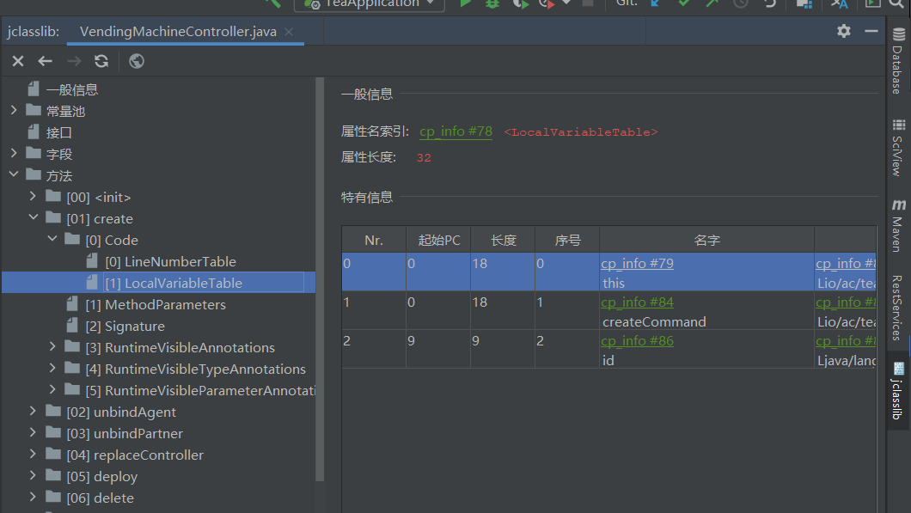
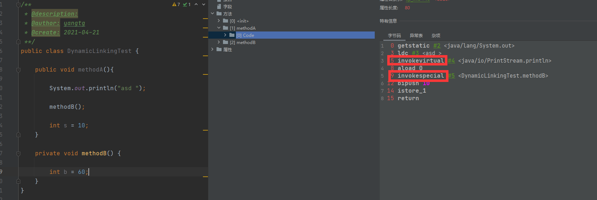
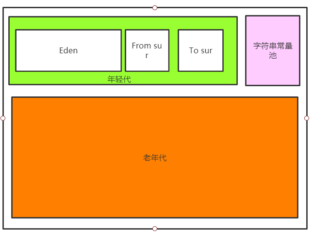
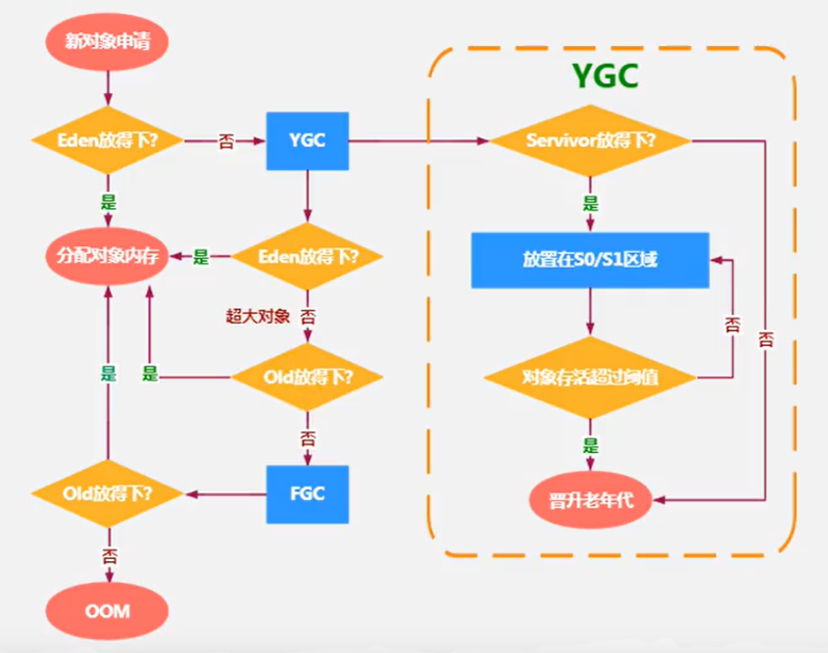
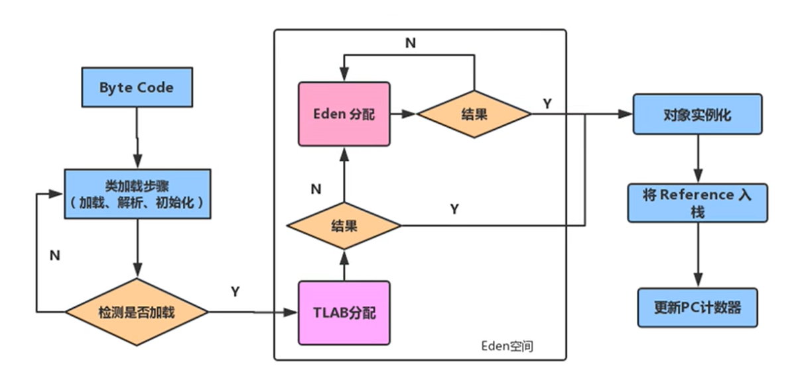

# JVM的运行时内存区域

## 程序计数器

程序计数器是线程私有的, 它可以看作是当前线程所执行字节码的行号指示器, 执行引擎通过改变这个计数器的值来选取下一条需要执行的字节码指令. 它用于多线程切换后能够恢复到正确的执行位置. 

## 虚拟机栈

虚拟机栈描述的是java方法执行的内存模型, 栈是线程私有的, 线程中每个方法执行的时候会压入一个栈帧, 用于存储局部变量表, 操作数栈, 动态连接(指向运行时常量池的方法引用), 方法出口(正常退出或异常推出)等信息.

### 1. 局部变量表

定义为一个数字数组, 用于存储方法参数和定义在方法体内部的局部变量, 这些数据类型包括各类基本数据类型, 对象的引用以及returnAddress类型.

局部变量表的大小在编译器确定下来, 并保存在方法的Code属性的maximum local variables数据项中.

局部变量表数组中的每个格子称之为Slot, 每个局部变量都会按照顺序复制到每一个Slot上, 每个Slot都有一个访问索引, 通过这个索引可以访问到局部变量表中的局部变量值. 

32位以内的类型只占用一个slot, 64位的占用两个. 

非静态方法的局部变量表的index为0的位置会放置this引用.

在以可达性算法实现的垃圾回收器中, 局部变量表中的变量也是垃圾回收的根节点之一. 被直接或间接引用的对象都不会被回收. 

局部变量表的大小会直接影响整个栈帧的大小, 进而也会影响栈可容纳栈帧的数量

---

### 2. 操作数栈

操作数栈是基于数组实现的.

操作数栈在方法执行过程中, 根据字节码指令, 往栈中写入或提取数据, 即入栈和出栈. 

操作数栈主要用于保存计算过程的中间结果, 同时作为计算过程中变量的临时的存储空间, 如果被调用的方法带有返回值, 返回值将会被压入当前栈帧的操作数栈中, 并更新程序计数器中下一条需要执行的字节码指令.

---

### 3. 动态链接

每个栈帧都是一个方法, 而方法是保存在方法区中的运行时常量池中的. 动态链接就是栈帧中指向运行时常量池中对应方法的引用. 这个引用的作用是为了支持当前方法的代码能够实现动态链接. 比如invokedynamic指令.

::: tip Tip
当java文件编译为字节码文件时, 所有的变量和方法引用都作为符号引用保存在class文件的常量池中, 在类加载的解析过程中, 这些符号引用就被解析为了直接引用.
当一个方法调用另一个方法时, 就是通过常量池中指向方法的符号引用来表示的. 
动态链接的作用就是为了将这些符号引用转换为调用方法的直接引用.
:::
 
除动态链接以外, 还有**静态链接**. 

    当一个字节码文件被加载到JVM内部时, 如果被调用的方法在编译器可知且运行期间保持不变时, 
    这种情况下将调用方法的符号引用转换为直接引用的过程称之为静态链接. 

    如果被调用的方法在编译器无法确定下来, 也就是说, 只能够在程序运行期间将调用方法的符号
    应用转换为直接引用, 由于这种引用转换过程具备动态性, 因此称之为动态链接. 
    
动态链接与静态链接的方法绑定机制也不同, 绑定是一个字段, 方法或类在符号引用被替换为直接引用的过程. 
动态链接的方法绑定为晚期绑定, 而静态链接的方法绑定为早期绑定.
     
早期绑定指被调用方法在编译器可知, 且运行期间不变即可将这个方法与所属类型绑定. 
晚期绑定指被调用方法编译器无法确定, 只能在程序运行期间根据实际类型绑定相关方法. 这类方法也被称为**虚方法**.
与之相对的早期绑定的方法即**非虚方法**.

--- 

### 4. 虚拟机中提供的方法调用指令

- **普通调用指令**:

    1. invokestatic: 调用静态方法
    2. invokespecial: 调用&lt;init&gt;方法, 私有方法, 父类方法(super)
    3. invokevirtual: 调用所有虚方法, 包括final修饰方法
    4. invokeinterface: 调用接口方法

- **动态调用指令**:

    1. invokedynamic: 动态解析出需要调用的方法, 然后执行
    
普通调用指令固化在虚拟机内部, 不可人为干预, 动态调用指令则可以由程序员使用, 如使用ASM   

### 5. 方法返回地址 

方法返回地址保存的是程序计数器的值, 也就是调用该方法的指令的下一条指令的地址

## 本地方法栈 

本地方法栈与虚拟机栈相似, 也是线程私有的, 里面的栈帧是虚拟机使用到的native方法服务

## 堆

jvm的堆内存是线程共享的, 用于存放对象实例, 是垃圾收集器管理的主要收集区域, 由于垃圾收集器采用分代算法, 所以堆又分为新生代与老年代.
 

新生代的Eden与From和To(两个Survivor)之间的大小比例默认为8:1:1, 新生代与老年代的大小比例默认为1:2.

### 对象内存分配

新对象**大部分** 分配到新生代的Eden区, 当新生代的Eden没有足够空间时会触发一次youngGC, 回收在Eden与From区中可达性分析中判断为可回收的对象, 如果对象本次不可回收将会移动到To区中. 然后对象的GC年龄+1. 同时
回收Eden与From区中的垃圾对象. 如果在迁移到To区时, To区空间不足, 则会直接进入老年代. 老年代空间不足时会触发FullGC
> ps: 这里有个问题算是扩展思考,  youngGC的时候, Eden和From区的不可回收对象要迁移到To区, 如果To区空间不足就要直接晋升到老年代, 这个晋升时Eden和From的不可回收对象全部晋升, 还是部分晋升? 如果是部分晋升的话是依据什么条件, 对象年龄排序吗? 
>
>
> 其实这个问题, JVM已经提前解决了, 详见下面的**空间分配担保**
  
若对象长期存活(对象的GC年龄达到15)会晋升入老年代, **大对象**分配时则会直接进入老年代(大对象应该尽量避免).

::: tip 大对象
youngGC后, Eden区为空, 此时分配对象大小若大于Eden区大小, 则会判定为大对象, 直接进入老年代.
:::

::: tip 动态对象年龄判定
若Survivor中相同年龄的对象大小总和达到了Survivor空间的一半, 那么大于等于这个年龄的对象将直接进入老年代. 若老年代还是不够, 则FullGC, 若还不够则OOM.
:::
::: tip 空间分配担保

youngGC之前会检查老年代最大可用连续空间是否大于新生代所有对象总空间, 若条件成立, 直接GC; 不成立, 会检查老年代最大可用连续空间是否大于历次晋升到老年代的对象的平均大小, 条件成立时,
尝试进行youngGC, 不成立则进行FullGC
:::

### TLAB

由于堆空间是线程共享的, 且对象创建的操作是非常频繁的, 因此在并发情况下在堆中分配对象空间是线程不安全的, 为了避免多线程操作同一个地址, 就需要使用加锁等机制来保证线程安全, 但同时也影响了分配的速度. 

TLAB(Thread Local Allocation Buffer)是java内存模型中的一部分, JVM在Eden中为每个线程分配一个线程的私有缓存区域, 当多线程并发分配内存时使用TLAB来避免并发问题. 如果TLAB分配失败, 则使用加锁机制确保内存分配的原子性

---

### 对象创建过程

1. 虚拟机遇到new命令时, 首先检查这个指令的参数是否能在常量池定位到一个类的符号引用, 并检查这个符号引用代表的类是否已经被加载, 解析和初始化过.
2. 分配内存. 对象所需内存的大小在类加载时就已经确定
3. 初始化分配的内存空间为零值.
4. 虚拟机对对象进行必要的设置. 例如这个对象是哪个类的实例, 如何才能找到对象的元数据信息, 对象的哈希码, 对象的GC分代年龄等信息. 这些信息保存在对象头中
5. 对于虚拟机来说, 前四步已经完成了对象的创建. 执行init方法

### 对象的内存布局

- **对象头**

存储对象自身的运行时数据. 如哈希码, GC分代年龄, 锁状态标志, 偏向线程ID, 偏向时间戳等.

存储类型指针, 即对象指向他的类元数据的指针, 虚拟机通过这个指针来确定这个对象是哪个类的实例(并不是所有虚拟机都这么做), 若对象是数组, 对象头中还需要一块用于记录数组的长度
- **实例数据**

对象真正存储的有效信息, 字段内容, 包括继承的.
- **对齐填充**

由于hotspot的自动内存管理系统要求对象的大小必须是8字节的整数倍, 而对象头部分正好是8字节的整数倍, 因此, 当实例数据没有对齐时, 需要对齐填充来补全.

### 对象的访问定位

java程序通过栈上的reference数据来操作堆上的具体对象, 但虚拟机规范并没有定义这个引用应该通过何种方式去访问堆中的对象, 现在的访问方式有两种:

- **句柄**

堆中划分出一块内存作为句柄池, reference中存储的是对象句柄的地址.

句柄中包含对象实例和类型数据各自的具体地址信息.

好处是当对象被移动时, 只会改变句柄中的实例数据指针, reference本身不需要修改.
- **直接指针**

reference中直接存储对象地址, 好处是访问速度快.

## 方法区

方法区域与堆一样是线程共享的, 用于存储虚拟机加载的Class信息, 常量, 静态变凉, 即时编译器编译后的代码.

方法区又称为永久代, 原因是hotspot虚拟机将GC分代回收扩展至方法区, 或者说使用永久代实现方法区, 目的是让垃圾回收器可以向管理堆一样管理方法区. 

永久代在JDK1.8及以后移除, 使用元空间代替.

### 运行时常量池

运行时常量池位于方法区内, 用于存放编译器生成的各种字面量和符号引用, 这部分内容在类加载后进入方法区的运行时常量池

::: tip 字面量
文本字符串, 声明为final的常量值
:::

::: tip 符号引用
- 类和接口的完全限定名
- 字段的名称和描述符
- 方法的名称和描述符
:::

## 内存溢出

内存溢出与内存泄露的区别: 内存溢出程序运行过程中申请的内存大于系统能够提供的内存, 导致无法申请到足够的内存, 于是发生内存溢出. 内存泄露指程序运行过程中分配内存给临时变量, 用完之后却没有GC回收, 始终占用着内存, 
既不能被使用也不能分配给其他程序.

下面记录了几种内存溢出的排查与解决方法

- **堆上的内存溢出**

使用内存映像工具对dump出的堆转储快照进行分析, 确认内存中的对象是否必要, 也就是先分清楚是出现了内存泄露还是内存溢出.

如果是内存泄露, 查看泄露对象到GC Roots的引用链. 

如果不存在内存泄露, 检查堆参数与物理机器对比是否还可以调大, 再检查代码是否某些对象的生命周期过长, 持有状态时间过长.

- **栈上的内存溢出**

主要检查多线程时的溢出, 虚拟机内存排除掉堆和方法区后, 每个线程分配到的栈容量越大, 可以创建的线程数量越少, 创建线程时越容易把剩下的内存耗尽. 
- **方法区的内存溢出**

在经常动态生成大量class的应用中, 需要特别注意类的回收状况. 

如果是JSP或动态生成JSP的应用同上.
