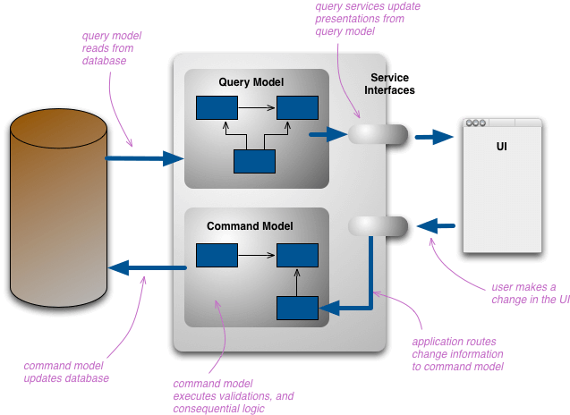

# 命令查询职责分离

CQRS分为读模型和写模型, 在微服务框架的可以体现为两个服务. 一个服务只供命令操作, 即写模型; 一个服务只供查询, 即读模型. 也可以是单个服务中的不同聚合.
 一个聚合为执行写操作时, 即作为写模型, 其他消费领域事件的聚合则为读模型.

写模型的数据会同步到读模型的数据存储中, 同步过程通过消息机制完成, DDD中的消息承载领域事件

## 读模型的数据来源

- 同个进程中的单个实体
- 同个进程中的多个实体
- 不同进程中的多个实体

## 读写分离的形式

1. 读写分离共享数据库. 同时共享代码模型, 查询数据通过模型转换后返回给调用方. 

2. 共享存储, 但代码中分别建立读写模型. 

> 在join级联层级过多时可以考虑分离存储, 写数据同步到读数据
> 
> 单个进程的分离存储读写同步可以使用Guava的EventBus

3. 分离存储/分离模型

> 使用与聚合查询多个服务的情况
>
> 单独的查询服务用于CQRS的读操作, 所需的数据通过事件驱动从其他服务同步过来
