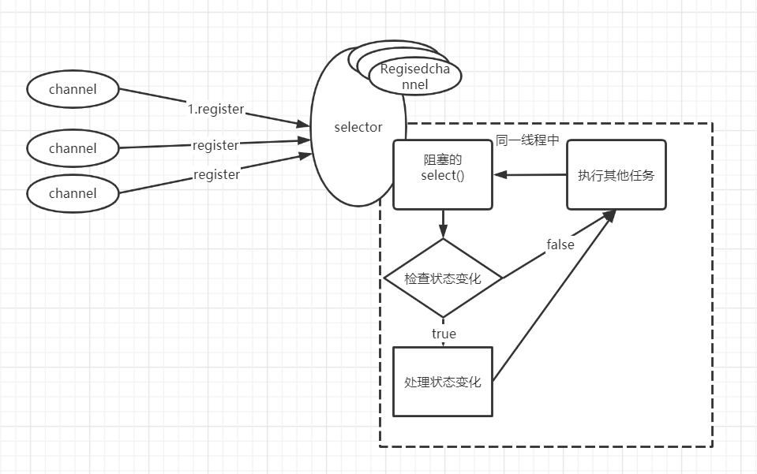
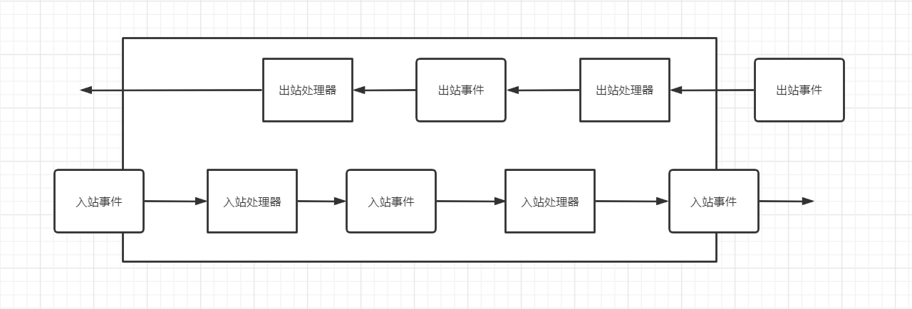

# 核心组件

Netty是一个异步的时间驱动的高性能网络编程框架, 它有比JavaApi更高的吞吐量与低延迟, 并且得益于资源的池化与复用, 有更低的资源消耗. 以及更少的内存复制. Netty提供了统一的API, 支持多种传输类型, 支持阻塞与非阻塞. 它具备简单强大的
线程模型. 

**一个简单通用的Netty Server**
```java 
public class NettyServer {

    public static void main(String[] args) {
        new NettyServer().bing(8080);
    }

    private void bing(int port) {
        EventLoopGroup parentGroup = new NioEventLoopGroup(1);
        EventLoopGroup childGroup = new NioEventLoopGroup();
        try {
            ServerBootstrap b = new ServerBootstrap();
            b.group(parentGroup, childGroup)
                    .channel(NioServerSocketChannel.class)
                    .option(ChannelOption.SO_BACKLOG, 128)
                    .childHandler(new ChannelInitializer<SocketChannel>() {
                        @Override
                        protected void initChannel(SocketChannel channel) throws Exception {
                            channel.pipeline().addLast(new MyOutboundHandler());
                            channel.pipeline().addLast(new MyInboundHandler());
                        }
                    });
            ChannelFuture f = b.bind(port).sync();
            f.addListener(future -> {
                ChannelFuture channelFuture = (ChannelFuture) future;
               if (channelFuture.isSuccess()){
                   ByteBuf buf = Unpooled.copiedBuffer("连接成功", Charset.defaultCharset());
                   channelFuture.channel().writeAndFlush(buf);
               }else {
                   channelFuture.cause().printStackTrace();
               }
            });
            f.channel().closeFuture().sync();
        } catch (InterruptedException e) {
            e.printStackTrace();
        } finally {
            childGroup.shutdownGracefully();
            parentGroup.shutdownGracefully();
        }

    }


    public class MyInboundHandler extends ChannelInboundHandlerAdapter {

        @Override
        public void channelActive(ChannelHandlerContext ctx) throws Exception {
            SocketChannel channel = (SocketChannel) ctx.channel();
            String str = "连接已建立";
            ctx.writeAndFlush(str);
        }
        
        @Override
        public void channelInactive(ChannelHandlerContext ctx) throws Exception {
            System.out.println("断开链接");
        }

        @Override
        public void channelRead(ChannelHandlerContext ctx, Object msg) throws Exception {
            System.out.println("收到客户端发送消息" +  msg);
            String str = "收到!";
            ctx.writeAndFlush(str);
        }

        @Override
        public void exceptionCaught(ChannelHandlerContext ctx, Throwable cause) throws Exception {
            ctx.close();
            System.out.println(cause.getMessage());
        }

    }


    public class MyOutboundHandler extends ChannelOutboundHandlerAdapter {

        @Override
        public void read(ChannelHandlerContext ctx) throws Exception {
            ctx.writeAndFlush("给你一句话, 铁汁!");
            super.read(ctx);
        }

        @Override
        public void write(ChannelHandlerContext ctx, Object msg, ChannelPromise promise) throws Exception {
            ctx.writeAndFlush("好好学习, 天天向上!");
            super.write(ctx, msg, promise);
        }
    }
}

```

 ## Channel
 
 Channel是JavaNIO中的一个基本构造. 它代表一个到实体的开放连接(比如到一个硬件设备, 一个网络套接字等). 可以理解为一个socket连接, 它是出入站数据的载体. Channel是**线程安全**的. 
 
 在Netty4中提供了四个Channel的基本实现.
  
 - OioSocketChannel. 已经不推荐使用
 ```java 
 /**
  * A {@link SocketChannel} which is using Old-Blocking-IO
  *
  * @deprecated use NIO / EPOLL / KQUEUE transport.
  */
 @Deprecated
 public class OioSocketChannel extends OioByteStreamChannel implements SocketChannel {...}
 ```
 - NioSocketChannel. 基于javaNio全异步实现.
 
 
 
 - EpollSocketChannel. 
 
 Netty为Linux提供的NIO API, 如果应用运行在Linux上, 使用这个版本的性能将由于java的nio实现. 
 ::: tip epoll
 
 epoll是一个linux中的高度可扩展的IO事件通知特性, 详见[linux-select/epoll](https://www.jianshu.com/p/ed1f9e9a1982)
 ::: 
 - KQueueSocketChannel.
 
 mac系统下使用将提供更高的效率
 
 ### Channel的生命周期
 
 --- 
 > ChannelUnregistered. channel已经创建, 但还没有注册到EventLoop
 >
 > ChannelRegistered. channel已经注册到了EventLoop
 >
 > ChannelActive. channel处于活跃状态, 已经连接到它的远程节点, 可以收发数据
 >
 > ChannelInactive. channel失去与远程节点的连接
 
 当channel的生命周期状态发生变化时都会生成对应的事件, 这些事件将会被转发到ChannelPipeline的ChannelHandler中.
 
## ChannelFuture

ChannelFuture实现并扩展了JDK所提供的Future接口. JDK的Future接口只允许手动检查Future的状态, 或阻塞等待Future进入完成状态, 在ChannelFuture中, 我们可以在之上注册ChannelFutureListener, 这些listener会在Future完成时被
调用(典型的观察者模式). 

Netty的每一个出站操作都会返回一个ChannelFuture, 这也是Netty实现全异步的一个关键特性. 

```java
        //配置服务端NIO线程组
        try {
            ...
            ChannelFuture f = ...
            f.addListener(future -> {
                ChannelFuture channelFuture = (ChannelFuture) future;
                // 检查future状态
               if (channelFuture.isSuccess()){
                   ByteBuf buf = Unpooled.copiedBuffer("连接成功", Charset.defaultCharset());
                   channelFuture.channel().writeAndFlush(buf);
               }else {
                   channelFuture.cause().printStackTrace();
               }
            });
            f.channel().closeFuture().sync();
        } finally {
            ...
        }
```

::: tip 注意
ChannelFuture的await的等待时间不等于IO操作的超时时间.
:::

 ## Event
 
 Netty使用不同的事件来通知状态的改变或操作的状态, 使我们能够基于已经发生的事件来触发适当的动作. 比如说记录日志, 数据转换, 业务逻辑等. 
 
 由于Netty是一个网络编程框架, 所以事件是按照它们与出入站数据流的相关性分类的. 
 
 
 ---
 由入站数据触发的事件:
 
- 一个Channel连接的激活与关闭.
- 一个用户事件的触发. 
- 数据的读取.
- 错误事件. 如timeout.
 
 
--- 
 出站事件:
- 打开或关闭一个到远程节点的连接. 
- 将数据write或flush到socket. 

 ### Call
 
 ---
 Call是IO事件触发时的回调, 它是一种抽象的概念, 可以理解为Reactor中的EventHandler角色, 在Netty中最典型的体现是ChannelHandler中的一个个钩子方法. 
 
 
 
 
## ChannelHandler
 
 ChannelHandler时Netty的出入站数据的应用程序逻辑的载体. 每当发生一个出入站事件发生或Channel的状态变化, Netty都会拉起ChannelPipeline中的Handler, 使事件在其中流动.
 
### ChannelHandler的生命周期方法
 
 |名称| 描述|
 |---|---|
 |handlerAdded| 当channelHandler被添加到ChannelPipeline中时被调用|
 |handlerRemoved| 当channelHandler被从pipeline中移除时调用|
 |exceptionCaught| 当在pipeline中有错误发生时调用|
 
 ### ChannelInboundHandler
 
 > ChannelInboundHandler接口扩展了ChannelHandler接口, 用于处理channel的入站事件. 
 
 |方法| 描述|
 |---| ---|
 |channelRegistered| channel注册到eventloop后调用|
 |channelUnregistered| channel从eventloop中移除后调用|
 |channelActive|channel处于活动状态时调用 |
 |channelInactive|channel不再处于活动状态时调用 |
 |channelRead|从channel读取中读取数据时调用 |
 |channelReadComplete|上一个读操作完成后调用|
 |userEventTriggered|当channelInboundHandler.fireUserEvetTrigered(obj)被调用后调用 |
 |channelWritabilityChanged|当channel的可写状态改变时调用 |
 |channelWritabilityChanged|当channel的可写状态改变时调用 |
 
 > 如果一个inboundHandler实现了channelRead方法时, 需要显示的释放与池化ByteBuf实例相关的内存, 可以借助`ReferenceCountUtil.release(msg)`释放
 
 ---
 
 **SimpleChannelInboundHandler**.实现了ChannelInboundHandler接口, 并重写了channelRead方法来自动释放资源. 
 ```java 
     @Override
     public void channelRead(ChannelHandlerContext ctx, Object msg) throws Exception {
         boolean release = true;
         try {
             if (acceptInboundMessage(msg)) {
                 @SuppressWarnings("unchecked")
                 I imsg = (I) msg;
                 channelRead0(ctx, imsg);
             } else {
                 release = false;
                 ctx.fireChannelRead(msg);
             }
         } finally {
             if (autoRelease && release) {
                 ReferenceCountUtil.release(msg);
             }
         }
     }
 ```
 
 由于SimpleChannelInboundHandler的自动释放机制, 所以不要存储任何指向消息的引用来供未来使用. 服务端不要使用这个.
 
 ### ChannelOutboundHandler
 
 > ChannelOutboundHandler接口扩展了ChannelHandler接口, 用于处理channel的出站事件
 
 |方法|描述|
 |bind| 当请求channel被绑定到本地地址时调用|
 |connect|当请求channel连接到远程节点时调用|
 |disconnect| 当请求channel从远程节点断开时调用, 此时还未关闭|
 |close|当请求channel关闭时调用|
 |deregister| 当请求channel从eventloop注销时调用|
 |read| 当请求从channel中读取数据时调用|
 |flush| 当请求通过channel向远程节点冲刷数据时调用|
 |write| 当请求通过channel向远程节点写入数据时调用|
 
 ::: tip ChannelPromise
 ChannelPromise接口扩展了ChannelFuture接口, 它提供的setSuccess和setFailure方法会使Future立刻进入完成状态 
 :::
 ### ChannelHandlerAdapter
 
 todo...
 ## ChannelPipeline
 
 ## EventLoop
 
 ## Bootstrap
 
 ## ByteBuf
 
 ByteBuf是JDK的ByteBuffer的替代者, 与ByteBuffer它的内部有两个索引: readIndex和writeIndex, 读写切换时不需要调用ByteBuffer的filp方法.用于区分已读字节区域, 未读字节区域, 可写字节区域. 
 
 ByteBuf支持引用技术, 支持池化, 支持方法的链式调用. 并且容量可以按需增长. 
 
 ### ByteBuf的使用模式 
 
 ---
 
 1. **堆缓冲区**
 
 > HeapByteBuf. 很显然数据存储在堆中, 由jvm管理创建和释放操作, 速度会快一些. 当进行IO操作时, 会先将内容拷贝到直接内存, 速度会慢一些.
 >
 > 由于jvm的管理, 它能够在没有池化的情况下快速分配释放. 
 
 2. **直接缓冲区**
 
 > DirectByteBuf. 数据存储在jvm堆外的直接内存中. 它是网络数据传输的理想选择, 因为socket在发送数据前, jvm会在内部把缓冲区先复制到一个直接缓冲区中, 而使用DirectByteBuf省略了这个复制过程. 缺点是创建和释放比较复杂, 相对于
 > HeapByteBuf会慢一些
 
 3. **复合缓冲区**
 
 > CompositeByteBuf. 它可以将多个缓冲区合并为一个. CompositeByteBuf中可能同时包含直接缓冲区和堆缓冲区, 当调用hasArray方法时, 若其中只有一个实例, 将返回这个实例的hasArray的值, 否则将返回false.
 > 
 > 在需要传递特定消息时可以使用这个. 比如消息头占用一个buf, 消息体占用一个buf.
 
 ### 字节操作
 
 ---
 
 ```java 
        +-------------------+------------------+------------------+
        | discardable bytes |  readable bytes  |  writable bytes  |
        |                   |     (CONTENT)    |                  |
        +-------------------+------------------+------------------+
        |                   |                  |                  |
        0      <=      readerIndex   <=   writerIndex    <=    capacity
 ```
 
 ByteBuf的readIndex和writeIndex将整个缓冲区分为了三个区域: 
 
 - **discardable bytes**. 可抛弃字节区域
 > discardReadBytes()方法可以丢弃已读区域的字节, 原理是将可读字节向前移动到缓冲区的起始位置, 然后修改writeIndex到可读字节区域的结束位置
 - **readable bytes**. 可读区域
 > 可读字节区域中存储了实际数据. read或skip开头的操作都将检索或跳过位于当前readIndex的数据, 同时增加已读字节数. 
 - **writable bytes**. 可写区域 
 > 任何以write开头的操作都会从当前writeIndex开始写数据, 同时增加已写的字节数. 
 ### 索引管理
 
 --- 
 
 | 方法 | 描述| 
 | --- | --- |
 |readIndex(int index)| 将readIndex修改到指定位置|
 |writeIndex(int index)| 将writeIndex修改到指定位置|
 |markReadIndex()| 标记当前readIndex的位置, 配合resetReaderIndex()使用|
 |markWriteIndex()| 标记当前writeIndex的位置|
 |resetReaderIndex()| 重置readIndex到markReadIndex标记的位置|
 |resetWriterIndex()| 重置writeIndex到markWriteIndex标记的位置|
 |discardReadBytes()| 丢弃readIndex位置之前的区域, 将readIndex置为0, 将writeIndex置为原readIndex|
 |clear|将两个索引置为0, 不清空内存区域. 相比教育discardReadBytes更轻量级|
 
 ### ByteBuf的分配
 
 ---
 Netty提供了ByteBufAllocator, Unpooled, ByteBufUtil类用于分配ByteBuf. 
 
 - **ByteBufAllocator**
 
 ```java 
 
     @Test
     public void test_byteBufAllocator(){
 
         ByteBuf buffer = ByteBufAllocator.DEFAULT.buffer();
         ...
     }
     
     public interface ByteBufAllocator {
         // 实际上是借助了ByteBufUtil实现的
         ByteBufAllocator DEFAULT = ByteBufUtil.DEFAULT_ALLOCATOR;
         ...
     }    
     
     public final class ByteBufUtil {
     
         ...
         static final ByteBufAllocator DEFAULT_ALLOCATOR;
     
         static {
             // 通过读取系统变量来选择默认的ByteBufAllocator的市里类型
             String allocType = SystemPropertyUtil.get(
                     "io.netty.allocator.type", PlatformDependent.isAndroid() ? "unpooled" : "pooled");
             allocType = allocType.toLowerCase(Locale.US).trim();
     
             ByteBufAllocator alloc;
             if ("unpooled".equals(allocType)) {
                 alloc = UnpooledByteBufAllocator.DEFAULT;
                 logger.debug("-Dio.netty.allocator.type: {}", allocType);
             } else if ("pooled".equals(allocType)) {
                 alloc = PooledByteBufAllocator.DEFAULT;
                 logger.debug("-Dio.netty.allocator.type: {}", allocType);
             } else {
                 alloc = PooledByteBufAllocator.DEFAULT;
                 logger.debug("-Dio.netty.allocator.type: pooled (unknown: {})", allocType);
             }
     
             DEFAULT_ALLOCATOR = alloc;
     
             ...
         }
         ...
     }   
 ```
 > ByteBufAllocator有两个实现类:PooledByteBufAllocator，UnpooledByteBufAllocator. 前者池化了ByteBuf的实例用于提高性能并最大限度的减少内存碎片, 后者没有池化, 每次都会返回一个新的实例.
 
 - Unpooled
 
 > Unpooled工具类提供了一系列的静态方法来辅助创建未池化的ByteBuf实例.
 
 ```java
public final class Unpooled {

    private static final ByteBufAllocator ALLOC = UnpooledByteBufAllocator.DEFAULT;

    // 分配一个堆中的ByteBuf
    public static ByteBuf buffer() {
        return ALLOC.heapBuffer();
    }

     //  分配一个直接内存中的ByteBuf
    public static ByteBuf directBuffer() {
        return ALLOC.directBuffer();
    }

    //  分配一个堆中的ByteBuf, 并指定初始容量大小
    public static ByteBuf buffer(int initialCapacity) {
        return ALLOC.heapBuffer(initialCapacity);
    }

    //  分配一个直接内存中的ByteBuf, 并指定初始容量大小
    public static ByteBuf directBuffer(int initialCapacity) {
        return ALLOC.directBuffer(initialCapacity);
    }

    //  分配一个堆中的ByteBuf, 并指定初始容量大小, 以及扩容的阈值
    public static ByteBuf buffer(int initialCapacity, int maxCapacity) {
        return ALLOC.heapBuffer(initialCapacity, maxCapacity);
    }

    //  分配一个直接内存中的ByteBuf, 并指定初始容量大小, 以及扩容的阈值
    public static ByteBuf directBuffer(int initialCapacity, int maxCapacity) {
        return ALLOC.directBuffer(initialCapacity, maxCapacity);
    }
    
    // 返回一个包装了给定数据的ByteBuf   
    public static ByteBuf wrappedBuffer(byte[] array) {
        if (array.length == 0) {
            return EMPTY_BUFFER;
        }
        return new UnpooledHeapByteBuf(ALLOC, array, array.length);
    }    

    // 返回一个复制了给定数据的ByteBuf   
    public static ByteBuf copiedBuffer(byte[] array) {
        if (array.length == 0) {
            return EMPTY_BUFFER;
        }
        return wrappedBuffer(array.clone());
    }    
```

- **ByteBufUtil**

> ByteBufUtil除分配ByteBuf实例外还提供了用于操作ByteBuf的静态辅助方法. 如hexdump()返回字节的十六进制格式. equals()方法比较两个ByteBuf的内容.

```java 
    @Test
    public void test_byteBufHexdump(){

        byte[] bytes = {0x12,0x31,0x11};
        ByteBuf unpooledHeapByteBuf = Unpooled.wrappedBuffer(bytes);
        // 网络应用中采用十六进制传输的方式非常常见, 所以这个方法很常用
        String hexString = ByteBufUtil.hexDump(unpooledHeapByteBuf);
    }
```

### 引用计数

---
引用计数是通过在某个对象所持有的资源不再被其他对象引用时释放该对象所持有的资源来优化内存使用和性能的技术. ByteBuf实现了ReferenceCounted接口.
```java
public interface ReferenceCounted {
    
    // 返回这个实例当前的引用数量
    int refCnt();

    // 将引用数量 + 1 
    ReferenceCounted retain();

    // 增加指定的引用数量
    ReferenceCounted retain(int increment);

     // 用于检查内存泄露的问题
    ReferenceCounted touch(Object hint);

    // 释放一个引用, 当引用计数为0时释放对象
    boolean release();

    // 释放指定数量的引用, 当引用计数为0时释放对象
    boolean release(int decrement);
}
```

::: tip release释放时机
一个ByteBuf通常会在一个ChannelHandler中一直向下传递, 如果在传递的过程中不对原消息做处理, 那么不需要释放, 如果消息被转换为了新消息并传递给下一个handler时, 必须手动释放. 释放的目地是将ByteBuf实例还回池中.
若不释放, 当ByteBuf被gc回收后, netty的对象池仍不知道这种情况, 会认为有越来越多的永不返回实例, 这时可能会产生内存泄露问题.
:::

Netty提供了一个TailHandler来做release操作, 如果handlers的传递过程中没有调用fireChannelRead(), 也需要手动释放.  TailHandler的释放是指对入站消息的释放, 出站消息的释放在HeadHandler的flush中.


