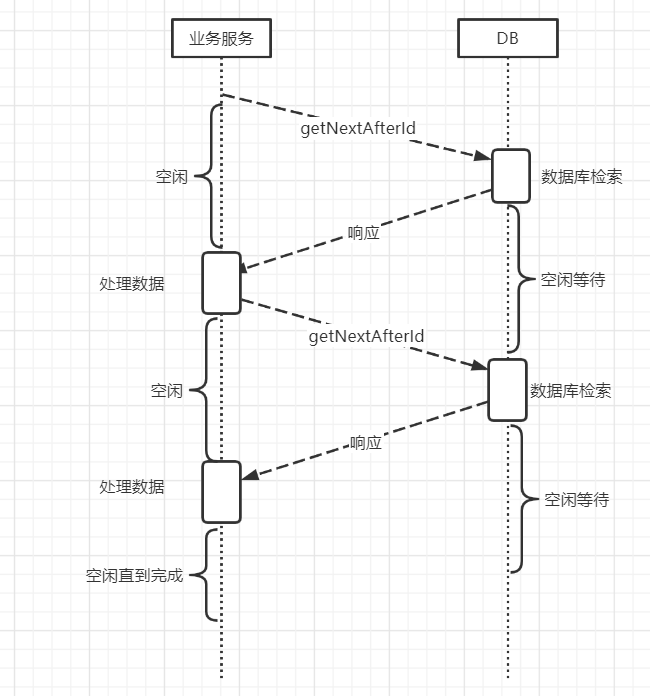
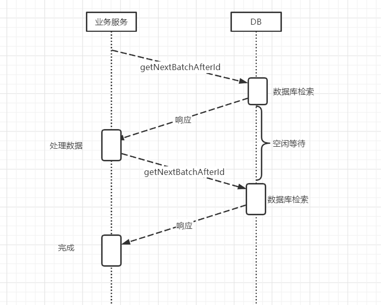
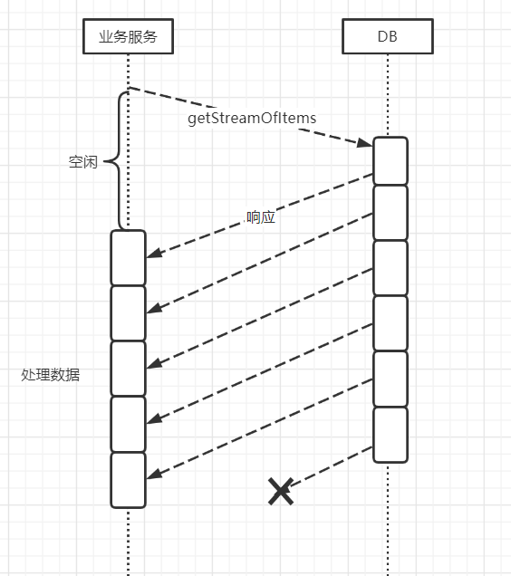

# 响应式流

## 推 与 拉

在响应式编程的早期, 所有库的设计思想都是把数据从源头推送到订阅者. 原因是拉模型在某些场景下效率不够高. 比如在一个有网络边界的系统中进行网络通讯. 如数据库请求. 

现在假设要从数据库中过滤出一部分数据, 只取前10个. 采用拉模型的方式如下: 

```java 
public class PullAndPush {

    class Item{
        private final Long id;

        public Item(Long id) {
            this.id = id;
        }

        public Long getId() {
            return id;
        }
    }

    interface AsyncDataBaseClient<T>{
        CompletionStage<T> store(CompletionStage<T> stage);
        CompletionStage<T> getNextAfterId(Long id);
    }

    private final AsyncDataBaseClient<Item> client = new AsyncDataBaseClient<Item>() {
        @Override
        public CompletionStage<Item> store(CompletionStage<Item> stage) {
            return null;
        }

        @Override
        public CompletionStage<Item> getNextAfterId(Long id) {
            return  CompletableFuture.supplyAsync(() -> new Item(id + 1));
        }
    };

    // 异步请求数据库, 当storage被填满时, future进入complete状态
    public CompletionStage<Queue<Item>> list(int count){

        BlockingQueue<Item> storage = new ArrayBlockingQueue<>(count);

        CompletableFuture<Queue<Item>> result = new CompletableFuture<>();

        pull(1L,storage,result,count);
        return result;
    }

    private void pull(Long elementId, BlockingQueue<Item> queue, CompletableFuture<Queue<Item>> result, int count) {

      client.getNextAfterId(elementId)
              .thenAccept(item -> {
                  // 从数据库中取出一个元素放到queue中
                  queue.offer(item);
                  if (queue.size() == count){
                      // 如果当前queue的size满足当前请求元素数量. 发出结束信号
                      result.complete(queue);
                      return;
                  }
                  // queue未满, 继续获取下个元素填充queue
                  pull(item.getId(),queue,result,count);
              });

    }
}
```

在上述代码中, 业务服务与数据库之间采用了异步非阻塞的交互机制. 但是它是有缺陷的. 



在逐个请求元素的过程中会导致整个请求的处理时间大部分浪费在业务服务的空闲等待上. 同时数据库不知道未来请求的数量, 意味着数据库不能提前生成数据, 因此在处于空闲状态, 等待新请求.
 
---

为了优化整体的执行过程, 我们加入批处理操作

```java 
public class PullAndPush {

    class Item{...}

    interface AsyncDataBaseClient<T>{
        ...
        CompletionStage<List<T>> getNextBatchAfterId(Long id, int count);
    }

    private final AsyncDataBaseClient<Item> client = new AsyncDataBaseClient<Item>() {
        
        ...
        
        @Override
        public CompletionStage<List<Item>> getNextBatchAfterId(Long id, int count) {
            return CompletableFuture.supplyAsync(() ->
                IntStream.rangeClosed(0,count)
                .mapToObj(i -> new Item(id + i))
                .collect(Collectors.toList())
            );
        }
    };

    ...
    
    private void pull(Long elementId, BlockingQueue<Item> queue, CompletableFuture<Queue<Item>> result, int count) {


      client.getNextBatchAfterId(elementId,count)
              .thenAccept(items -> {
                  for (Item item : items) {
                      
                      queue.offer(item);
                      if (queue.size() == count){
                          result.complete(queue);
                          return;
                      }
                  }
                  pull(items.get(items.size() - 1).getId(),queue,result,count - queue.size());
              });
    }
}
```

加入批处理的操作可以显著的减少整体请求的空闲时间, 但仍存在一些缺陷. 



数据库在进行检索数据时, 业务服务仍然需要空闲等待. 同时数据库批量发送数据比发送单个数据需要更多时间. 

---

我们的最终优化目标: 只请求一次数据, 当数据可用时, 数据源会异步推送数据.

```java 

public Observable<Item> list(int count){
    return client.getStreamOfItems()
    // 根据请求获取固定数量的数据
    .take(count);
}
```

执行流程如下:



经过这个小demo可以看出, 推模型可以将请求量降低到最小来优化整体的处理事件.  这也就是为什么RxJava以及类似的响应式类库为什么以推送数据为目地进行设计, 为什么流技术能成为分布式系统中组件之间重要的通信技术. 

但如果仅仅是与推模型组合, 也是有局限性的. 消息驱动的本质是每个请求都有一个响应, 因此服务可能收到异步的潜在的无线消息流. 如果生产者不关心消费者的吞吐能力, 可能会产生其他的缺陷如**慢生产者与快消费者**或**快生产者与慢消费者**. 

// todo
